# Weather Intelligence Service — Project Bible

**Document type:** Solution Architecture Document / Project Bible (single source of truth)
**Subject:** Standalone, AI-augmented Weather Intelligence Service (internship module, TravelOS-inspired)
**Status:** Pre-implementation. No code written. Every downstream artifact (Product Vision, PRD, TRD, SAD, API spec, DB design, UI/UX spec, sprint plan, roadmap, testing strategy, deployment guide, README, presentation, internship report) is a *view* onto this document, not written independently of it.
**Prepared as:** Principal/Enterprise Architect + Technical Product Manager review, in a technical co-founder capacity.

---

## Part 0 — Co-Founder's Review Note (read this first)

This is a review, not a rewrite. Your existing blueprint made the hard calls correctly, and I have kept them. My job here is to validate what's right, challenge what's weak — including two requests in your own brief — fill the missing sections, and hand you one cohesive, implementation-ready document.

### What I kept from your blueprint (because it's right)

- **Deterministic core, optional AI skin.** The single most defensible decision in the project. Everything else exists to protect it.
- **Two planes (Ingestion / Serving), four inward-pointing layers.** This is what "Clean Architecture" actually means — dependency direction, not box-stacking.
- **LLM as a separate, optional endpoint** — never a flag on the deterministic call.
- **Two engines (Insight + Recommendation), not five.** Enough separation to demonstrate the concept, not so much you maintain five near-empty classes.
- **Postgres-only MVP; Redis deferred to V2 with a stated trigger.**
- **Explicit out-of-scope guardrail** (no itineraries, no named POIs, no chatbot). This is the thing an internship reviewer is actually grading.

### Where I challenge the brief (this is the co-founder part)

| # | Brief asked for | My disposition | Why |
|---|---|---|---|
| 5 | Rename `NarrationService` → **"Travel Advisor AI"** | **Rejected.** Keep `NarrationService`; UI label "AI Explanation." | "Advisor" is a decision-maker's title. It contradicts your non-negotiable principle and a reviewer will spot the contradiction. See §26. |
| 10 | Evaluate **Vector Database** | **Rejected for all versions.** | The LLM gets a complete structured object. Nothing to embed or retrieve. A vector DB solves a problem you don't have. |
| 10 | Evaluate **LangChain** | **Rejected for MVP/V2.** | One structured prompt call doesn't need an orchestration framework. It adds dependency weight and blurs the boundary you're graded on. |
| 3, 9 | Rich frontend "assistant" with many features | **Applied, but re-scoped.** Focused dashboard over the same API, V2, not a chatbot. | Prevents the frontend from becoming the center of gravity and quietly turning into the conversational UI your own blueprint bans. See §25. |
| 4 | Add Overall Risk **and** Overall Score **and** Trip Suitability **and** Travel Confidence | **Applied, but disambiguated.** | Four overlapping aggregate scores blur into noise. I define each with a distinct meaning so none is redundant. See §23. |
| 1 | Insight Engine → Decision Engine | **Applied** (matches your blueprint's two-engine model). | Correct simplification. |

### What I added (the real gaps the brief asked for and the blueprint didn't yet have)

Business goals, stakeholders, user personas, a full end-to-end user journey (§7), an expanded 11-type testing strategy (§32), a proper frontend design (§25), an expanded security and performance treatment (§28, §30), a deployment section (§33), and a sprint plan (§38).

### The one sentence that governs every decision below

> **The deterministic engine is the product. The LLM is a presentation detail. If a decision makes the LLM more central or the engine less testable, it is wrong.**

---

# PART I — PRODUCT

## 1. Executive Summary

You are not building TravelOS. You are building **one well-bounded module** that TravelOS — or any planning system — could later consume without modification. That boundary is the project.

The **Weather Intelligence Service** turns raw meteorological data into decision-ready travel intelligence: risk levels, activity-suitability scores, packing guidance, and best/worst travel days, at both per-day and whole-trip granularity. A deterministic engine computes all of it and is fully testable with zero network, zero database, and the LLM switched off. An optional **Narration Service** sits at the edge and phrases that already-computed intelligence in natural language — it never computes, ranks, or decides anything.

The architecture is two planes — an **Ingestion Plane** that fetches, normalizes, and stores weather from pluggable providers, and a **Serving Plane** that reads from storage and runs the engines — organized into four layers whose dependencies all point inward toward a pure domain. The success test is single and concrete: *an unrelated system can call this service's REST API and get usable intelligence with zero changes to this codebase.* If that holds, the design holds.

## 2. Project Vision

A production-inspired, internship-sized service that ingests weather from external providers, normalizes and persists it, and **deterministically** derives travel-relevant intelligence (risk, suitability, packing, timing) — optionally narrated by an LLM — exposed through a documented, versioned REST API designed to plug into a TravelOS-style planner as one context input among several.

The vision is deliberately narrow. The value on display is not "I built a weather thing," it is "I can take an ambiguous, over-scoped brief and carve out a defensible bounded context, then build it cleanly enough that a larger system can consume it untouched." That is a senior-engineering signal, and it is the actual thing under evaluation.

## 3. Problem Statement

Weather APIs answer *"what will the weather be."* They do not answer the question a traveler or a planning system actually has: *is this a good day for the beach; what should I pack; is this trip riskier than usual; which of these five days should I do the outdoor thing on.* That translation — from raw forecast to travel decision — does not exist as a reusable, provider-agnostic, deterministic service. Consumers today either hand raw forecast numbers to an LLM and hope (unauditable, non-reproducible, hallucination-prone) or hard-code weather rules inside an application (not reusable, not testable in isolation). This project fills the gap with an explainable engine whose every output traces back to a rule, wrapped in a stable API contract.

## 4. Business Goals

Framed as an internship deliverable, the goals are both product and professional:

- **G1 — Demonstrate bounded-context discipline.** Ship a module with a defensible boundary and an explicit out-of-scope list. Success metric: a reviewer can state, in one sentence, what this service does and does not do.
- **G2 — Demonstrate clean, testable architecture under real constraints.** Multiple external APIs, caching, persistence, an optional LLM — all behind interfaces, with a domain layer that unit-tests with no I/O. Success metric: engine test suite runs green offline with the network unplugged.
- **G3 — Demonstrate restrained, auditable AI usage.** The LLM is isolated, optional, and non-authoritative. Success metric: the full deterministic product works with the LLM disabled, and a diff of the two responses touches only the `narrative` block.
- **G4 — Produce a consumable contract.** A stable Weather Intelligence schema and REST API a TravelOS-shaped system could call with no adapter beyond an HTTP client. Success metric: the integration story (§27) requires zero changes to this service.
- **G5 — Stay internship-sized.** Every component is justifiable, not merely impressive. Success metric: for each pattern and each piece of infrastructure, there is a one-line "why now" that isn't "best practice."

## 5. Stakeholders

| Stakeholder | Interest | What they evaluate |
|---|---|---|
| **You (the intern)** | Learning, a strong portfolio artifact, a clean codebase | Whether the design shows judgment, not just output |
| **Mentor** | Whether you understood the reference architecture and drew the right boundary | Scope discipline, the deterministic/AI split, integration clarity |
| **The (future) TravelOS platform team** | Whether this module can be consumed cleanly | API/schema stability, provider abstraction, resilience |
| **Reviewers / interviewers** | Whether you can reason about trade-offs | ADRs, "why not X" answers, scalability *reasoning* (not scale) |
| **End traveler (indirect)** | Actionable, trustworthy weather guidance | Explainability, correctness, graceful degradation |
| **Upstream weather providers** | Fair use of their quotas | Caching, rate limiting, respectful fallback behavior |

The two that matter most for grading are the **mentor** and **reviewers** — both are evaluating *judgment*. Design and document for them.

## 6. User Personas

Because the service is API-first and platform-facing, "users" split into machine consumers and human end-users.

- **Priya — the Weekend Traveler (end-user, via the demo UI).** Planning a 4-day Goa trip in monsoon season. Wants to know which days are safe for the beach, what to pack, and whether to worry — in plain language, in a few seconds. Does not want a chat interface; wants to type a place and dates and get a dashboard.
- **TravelOS Planner — the Machine Consumer (primary "user").** An AI trip-planning service that calls `/intelligence` for a location and date range and folds the JSON into a larger prompt alongside trip context, destination knowledge, and budget rules. Cares only about schema stability, latency, and resilience. Never sees the UI.
- **Deepak — the Integrating Engineer (platform team).** Needs to wire TravelOS to this service. Reads the OpenAPI spec and the README's "how this plugs into TravelOS" section. Success for him is *no surprises*: the contract matches the docs, failures are well-behaved, and the narrative field is optional.
- **The Mentor/Reviewer (evaluator).** Reads the ADRs and asks "why is the LLM outside the Decision Engine" and "walk me through a provider outage." Success is that every answer is already written down and consistent.

The primary user is **the machine consumer**. The UI serves Priya, but the *architecture* serves the Planner. Never let UI convenience distort the API contract.

## 7. User Journey (end-to-end)

Two journeys matter: the human (demo UI) and the machine (TravelOS). Both hit the same Serving Plane.

### 7a. Human journey (demo dashboard, V2)

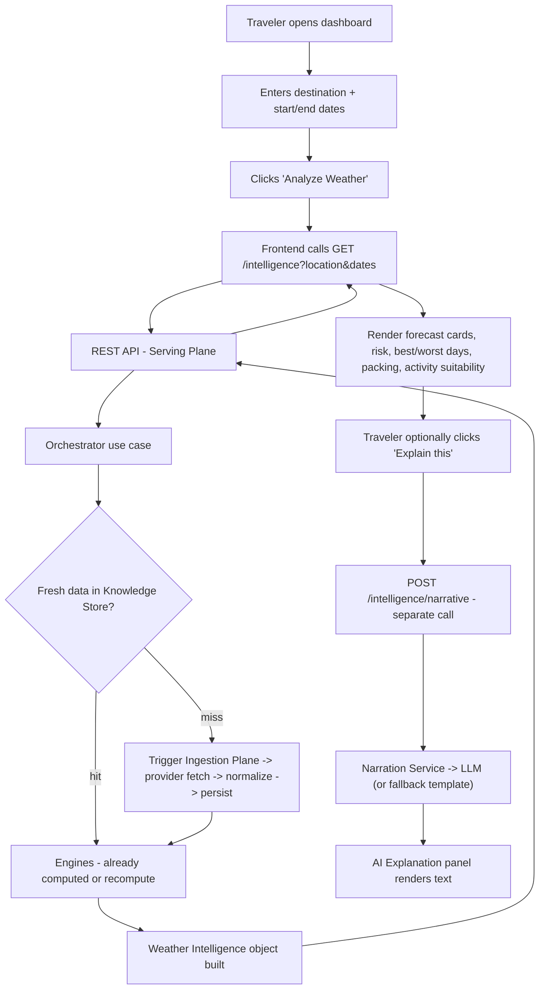

The critical design fact visible in this diagram: **the deterministic dashboard renders completely before, and independently of, any LLM call.** The "Explain this" panel is a second, optional request. If the LLM is down, the traveler still gets the full analysis; only the prose paragraph is missing (or replaced by a templated fallback).

### 7b. Machine journey (TravelOS)

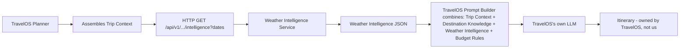

TravelOS never touches our narrative endpoint — it wants the *structured* intelligence to feed its own planner. Our narration is for the human demo and for API consumers who want a ready-made explanation, not for the planning pipeline.

---

# PART II — REQUIREMENTS & SCOPE

## 8. Functional Requirements

1. **FR1 — Fetch.** Retrieve current and forecast weather for a location and date range from at least one external provider (two by V2, to prove the abstraction).
2. **FR2 — Normalize.** Translate provider-specific response shapes into one internal weather model, independent of provider.
3. **FR3 — Persist.** Store raw normalized readings and computed daily intelligence.
4. **FR4 — Compute (per day).** Temperature/precipitation/wind summary; risk level + contributing risk factors; activity-suitability scores for a fixed set of activity categories; packing recommendations.
5. **FR5 — Compute (per trip).** Best day(s), worst day(s), aggregated packing list, and trip-level aggregate scores (§23).
6. **FR6 — Narrate (optional).** Generate a natural-language summary of the above via an LLM **without altering any computed value**.
7. **FR7 — Serve.** Expose all of the above through a versioned REST API.
8. **FR8 — Cache.** Cache provider responses and computed intelligence to reduce redundant upstream calls.
9. **FR9 — Degrade gracefully.** A provider outage or LLM outage must never crash a request; it produces a degraded-but-valid response.
10. **FR10 — Report provider health.** Expose provider availability/health for diagnostics and fallback decisions.

## 9. Non-Functional Requirements

- **Explainability.** Every risk/suitability score traces to a named rule, never a black box. A consumer can ask "why is this day high-risk" and get factor-level provenance.
- **Determinism.** Identical inputs (weather data + rule config) always produce byte-identical intelligence. This is what makes the engine testable and the LLM's non-involvement provable.
- **Resilience.** Provider or LLM outage degrades gracefully; timeouts and circuit breakers on every external call.
- **Testability.** Domain logic unit-tests with zero network and zero DB.
- **Extensibility.** Adding a provider or a suitability rule must not require touching the API or orchestration layer.
- **Portability.** The service is consumable as a standalone API by an unrelated system without modification. *This is the acceptance test for "well-architected."*
- **Observability.** Structured logs, request tracing, and per-external-call metrics (latency, success/failure, cache hit/miss) — enough to answer "what happened" without a debugger.
- **Performance.** A cache-hit intelligence request returns in well under a second; the deterministic path never blocks on the LLM (see §30).

## 10. Scope (what you actually build)

**In scope — MVP + V2:**
- Multi-provider weather ingestion with normalization and persistence
- Deterministic Insight (rules → risk → scoring) and Recommendation (trip-level) logic
- Weather Intelligence object generation (per-day + trip rollup)
- Best/worst day ranking, packing recommendations, activity suitability
- Optional LLM narration, isolated and feature-flagged, on its own endpoint
- Versioned REST API + OpenAPI documentation
- Caching (in-memory → Redis)
- Historical raw-reading storage
- A focused read-mostly demo dashboard (V2)

## 11. Out of Scope (state this almost verbatim in your report)

- Itinerary generation of any kind
- Named attraction / POI recommendation
- A chatbot or open-ended conversational interface
- Multi-tenant auth, billing, SSO
- Kubernetes, message queues, multi-region deployment
- Any custom-trained weather-forecasting model (you consume provider forecasts; you do not build your own)
- Budget / pricing logic (that is TravelOS's Budget Rules module)
- Vector database and LLM-orchestration frameworks (LangChain) — see §20 for why these are out even though the brief listed them

Put the in/out split in your report near-verbatim. It is the single clearest signal that you understand boundaries — usually the actual thing being evaluated.

---

# PART III — ARCHITECTURE

## 12. System Overview

The system is two planes that meet at one shared persistence boundary (the Knowledge Store):

- The **Ingestion Plane** is write-side: Provider Registry (Factory) → Provider Adapters (Strategy) → Normalization Pipeline → Knowledge Store. It runs on cache-miss (MVP) or on a schedule (V3). It is the only place that speaks a third-party API's dialect.
- The **Serving Plane** is read-side: REST API → Orchestrator (use cases) → Insight Engine → Recommendation Engine → Intelligence Builder → (optional) Narration Service. It reads from the Knowledge Store and only triggers ingestion on a miss.

Both planes obey one dependency rule: **everything points inward toward a pure domain that imports nothing.** Infrastructure implements domain interfaces; the domain never imports infrastructure.

## 13. Architecture Analysis — critique of the original linear design

Your first draft was a single vertical call-stack (`REST API → Orchestrator → Engines → Builder → Store → Pipeline → Registry → Providers`). Five problems, all now fixed:

1. **It was a call stack, not a layered architecture.** A vertical list shows call *order*, not dependency *direction*. Clean Architecture is about the latter. **Fixed** by naming explicit layers (Interface / Application / Domain / Infrastructure) so the dependency rule is visible in the diagram itself.
2. **Ingestion and serving were conflated.** The linear diagram implied every request walks all the way down to the providers — which defeats the purpose of having a store. **Fixed** by splitting the two planes; serving reads from the store, ingestion runs on miss. This is the most consequential change and it is what makes the caching, rate-limit, and resilience stories *real* rather than implied.
3. **The engines were drawn as unordered peers.** In reality Recommendation must consume Insight's output — you cannot rank "best day" before knowing each day's risk. **Fixed** by making the sequence explicit: Insight → Recommendation.
4. **The LLM had no home.** Your own top principle is "the LLM never replaces deterministic calculations," yet it wasn't in the diagram, so the boundary was unverifiable. **Fixed** with an explicit, optional `NarrationService` that sits *after* the Recommendation Engine, consumes finished intelligence read-only, and is never on the path of any endpoint that returns numeric/decision data.
5. **The store sat between the Builder and the Pipeline**, reading as if computed intelligence is stored before raw data — backwards. **Fixed** as a symptom of #2; once the planes split, the store is simply the shared boundary both use.

None of this was a rewrite. It was: relabel into real layers, split the two planes, order the engines, give the LLM its own optional box.

## 14. Improved Architecture

Two planes, four shared layers, dependencies pointing inward:

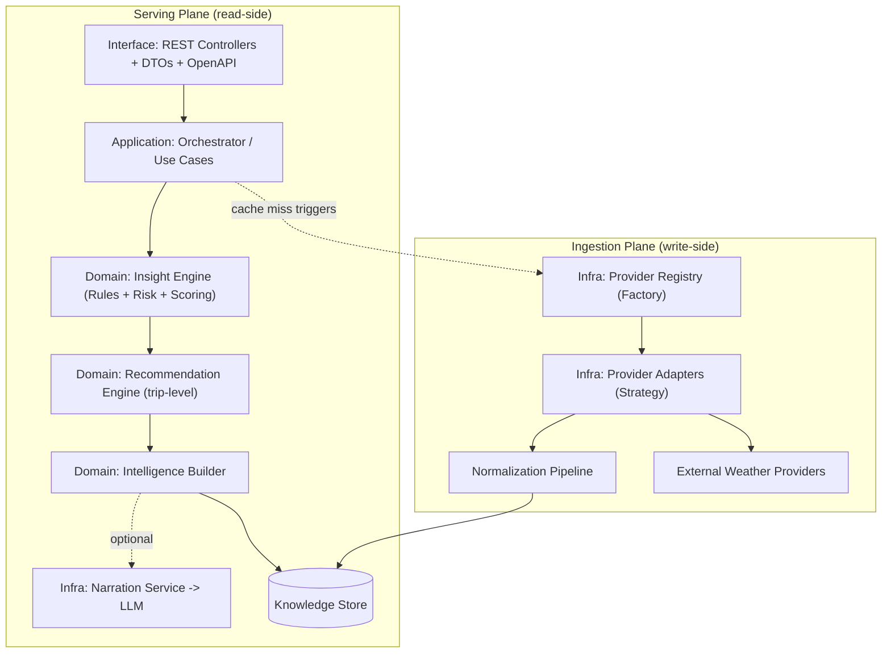

**Layer responsibilities and dependency direction:**

| Layer | Contains | May depend on |
|---|---|---|
| **Interface** | REST controllers, request/response DTOs, OpenAPI spec | Application layer only |
| **Application** | Orchestrator / use cases (`GetWeatherIntelligence`, `GetBestDays`, `GetPackingList`, `GenerateNarrative`) | Domain interfaces only |
| **Domain** | Insight Engine, Recommendation Engine, `WeatherIntelligence` entities & value objects | **Nothing** (pure logic, no I/O) |
| **Infrastructure** | Provider adapters, Provider Registry, Postgres repositories, cache client, LLM client (`NarrationService` impl) | Domain interfaces (it *implements* them) |

This is the operational meaning of the "Clean Architecture" principle you listed: dependencies point inward, and the domain never imports infrastructure. It is also why the LLM's isolation is *enforceable* rather than aspirational — `NarrationService` is an interface the domain never sees; only the `GenerateNarrative` use case calls it, and it is the only use case allowed to.

**Why this is defensible at internship scale:** you are not adding services, queues, or infrastructure. You are organizing the same components you already proposed into a shape where the dependency rules are checkable in code review. That is the whole value.

## 15. Architecture Diagrams

### 15a. C4-style container view (conceptual)

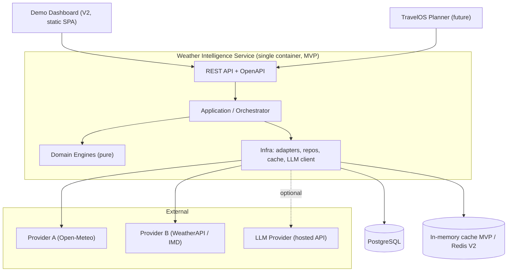

### 15b. Dependency rule (the diagram a reviewer actually wants)

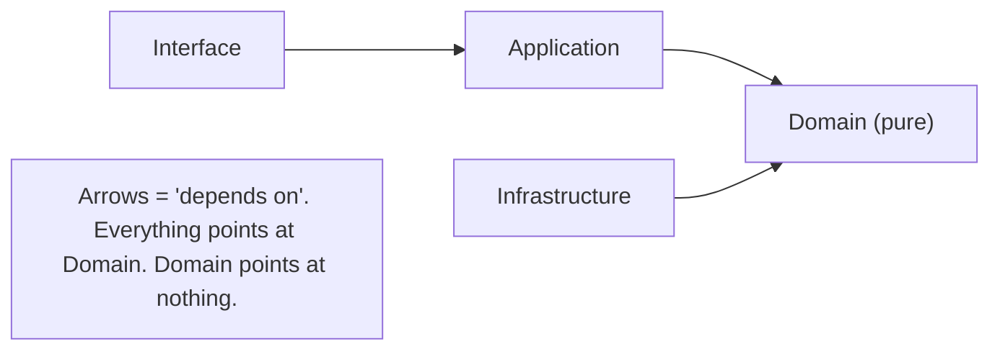

## 16. Sequence Diagrams

**Serving path — cache hit, no LLM (the common case):**
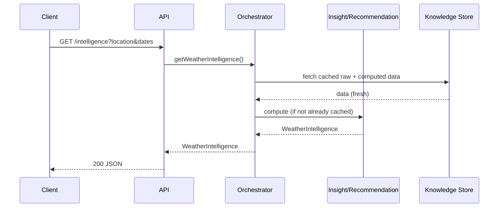

**Ingestion path — cache miss:**
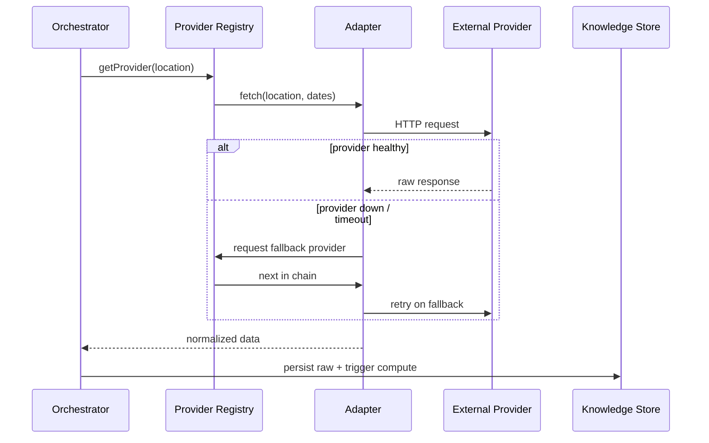

**Optional narration — separate call, never blocking:**
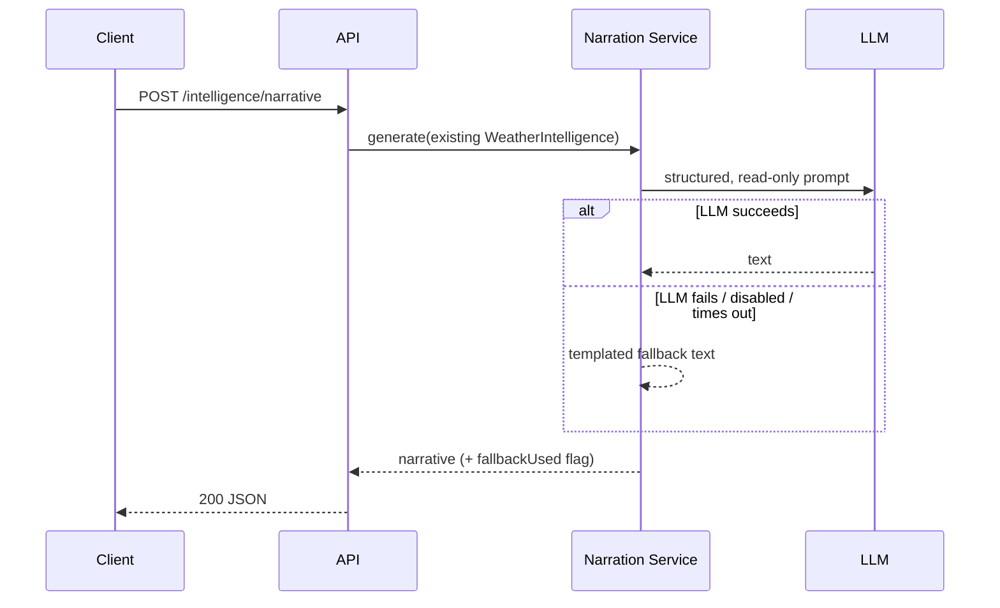

## 17. Data Flow Diagram

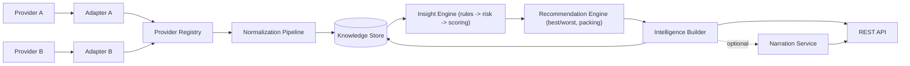

## 18. Component Responsibilities

- **Provider Adapter (Strategy).** One per external API. Implements a common `WeatherProvider` interface; translates provider-specific responses into the internal normalized model.
- **Provider Registry (Factory).** Selects active provider(s), holds fallback order, exposes `getProvider()` / `getFallbackChain()`.
- **Normalization Pipeline.** Orchestrates fetch → validate → normalize → persist for the ingestion plane.
- **Knowledge Store (Repository).** Persistence boundary over raw readings and computed intelligence; the only component both planes share.
- **Insight Engine.** Pure. Internally: **Rules** (config-driven thresholds, e.g. "wind > 40 kph ⇒ high wind risk"), **Risk** (aggregate rule outputs into a risk level + factors), **Scoring** (per-activity suitability from summary + rules). These are modules *inside* one engine, not three top-level services.
- **Recommendation Engine.** Pure. Consumes Insight output across the date range to produce best/worst days, aggregated packing list, and trip-level scores.
- **Intelligence Builder.** Assembles the final `WeatherIntelligence` object (§23) per day and trip-level.
- **Narration Service (optional, infrastructure).** Takes a finished `WeatherIntelligence` object, returns natural-language text; never overwrites a computed field; fails soft to a templated string if the LLM is down or disabled.
- **Orchestrator (Application).** The only component that knows the *order* of the above. Nothing else calls anything out of sequence.

## 19. Folder Structure

```
weather-intelligence-service/
  src/
    interface/
      http/            # controllers, routes, DTOs, error mapping
      openapi/         # spec (generated + hand-authored)
    application/
      use-cases/       # GetWeatherIntelligence, GetBestDays, GetPackingList, GenerateNarrative
      ports-in/        # request/response contracts for use cases
    domain/
      entities/        # WeatherIntelligence, DailyIntelligence, RiskAssessment, value objects
      engines/
        insight/       # rules, risk, scoring (modules, one engine)
        recommendation/# best/worst days, packing, trip scores
      ports/           # interfaces: WeatherProvider, WeatherRepository, NarrationService, CacheClient
    infrastructure/
      providers/       # open-meteo-adapter, weatherapi-adapter, provider-registry
      persistence/     # postgres repositories, migrations
      cache/           # in-memory (MVP) / redis (V2)
      ai/              # LLM client implementing NarrationService + fallback templates
      config/          # env loading, DI container wiring, feature flags
      observability/   # logger, metrics, request-context
  tests/
    domain/            # engine unit tests, zero I/O
    integration/       # API + DB tests
    contract/          # schema/contract tests for consumers
  docs/
    adr/               # ADR-001..N
    openapi.yaml
    architecture.md    # this bible's condensed SAD view
  frontend/            # V2 demo dashboard (separate build)
```

The `domain/` folder having **no imports from `infrastructure/`** is the thing to enforce in review (a lint rule or dependency-cruiser check makes it mechanical). That single constraint is the physical embodiment of the whole architecture.

## 20. Technology Stack

| Concern | MVP choice | Why (and what I rejected) |
|---|---|---|
| **Language / runtime** | **TypeScript / Node.js** | Matches the reference TravelOS code, so this drops in without a language boundary. You already ship Node/Express, so it's executable in the internship window. *FastAPI (Python) is the better pick only if the surrounding platform were Python* — its Pydantic validation and auto-OpenAPI are genuinely nicer, and given your ML background it would be comfortable. But portability into a TS platform is the success metric, and a language seam at the integration point is a real cost. TS wins on the deciding factor. |
| **API framework** | **Fastify** (or Express) | Lightweight, first-class schema/validation and JSON-schema-to-OpenAPI. Express is fine too; no scope creep either way. |
| **Persistence** | **PostgreSQL** | Relational fit for readings + intelligence, JSONB for semi-structured payloads, and it can serve as a crude freshness-checked cache on its own for MVP. |
| **Cache** | **In-memory (MVP) → Redis (V2)** | Don't add infra you can't justify. Redis earns its place when you need cross-instance cache sharing or TTL/eviction sophistication — with a stated trigger, not "enterprise uses Redis." |
| **LLM** | **Any hosted API behind a `NarrationService` interface** | Swappable, isolated, optional. Model choice (Gemini vs OpenAI vs other) is an infrastructure detail behind the interface — pick on cost/latency/availability; the domain never knows which. |
| **Docs** | **OpenAPI / Swagger** | Deliverable + interview artifact + the contract Deepak reads. |
| **Testing** | **Jest / Vitest + Supertest** | Domain unit-testable with no I/O; Supertest for API/integration. |
| **Containerization** | **Docker + docker-compose** | Single service + Postgres; adds Redis as a second container in V2. |

**Explicitly rejected technologies (the brief listed these; here is why they're out):**

- **Vector database — rejected, all versions.** A vector DB exists to retrieve semantically-similar chunks from a corpus. The LLM here receives a *complete, structured intelligence object* as its entire input — there is nothing to retrieve and nothing to embed. Adding one would be a pattern in search of a problem, and a reviewer will ask "what are you embedding?" and you won't have an answer.
- **LangChain — rejected for MVP/V2.** LangChain orchestrates multi-step, multi-tool LLM chains. Your LLM usage is a *single* structured prompt over already-computed data. Wrapping that in an orchestration framework adds a heavy dependency, a moving-target API, and — worst — it *blurs the clean boundary* you're graded on, because it invites "just let the chain also decide X." A thin, direct client behind your own `NarrationService` interface is clearer and more defensible. Revisit only if narration genuinely becomes multi-step (it won't at this scope).
- **IMD (India Meteorological Department) provider — deferred to V2/stretch.** A nice India-specific second adapter to demonstrate the Strategy pattern with a regionally-relevant source, *if* its API access and stability cooperate. Open-Meteo (free, no key) is the right MVP provider; IMD is a good "prove the abstraction with something real" follow-up, not an MVP dependency.

## 21. Design Patterns (and where each earns its place)

- **Strategy — Provider Adapters.** Interchangeable fetch/normalize behavior per provider; also reusable if you ever swap LLMs behind `NarrationService`.
- **Factory — Provider Registry.** Constructs and returns the right adapter and fallback chain.
- **Repository — Knowledge Store.** Hides Postgres behind a domain-facing interface so the domain never sees SQL.
- **Adapter — every external provider and the LLM client.** Adapted to internal interfaces (`WeatherProvider`, `NarrationService`) so the domain never speaks a third party's dialect.
- **Dependency Injection.** Application receives domain/infra dependencies through interfaces, not concrete imports — this is *what makes engines testable without a DB or network*, and it's the justification a reviewer will accept.
- **Chain of Responsibility (optional, V2).** Provider fallback (try A, then B) is naturally this, if you want to name it explicitly.

Resist adding more than this. A reviewer will ask you to justify each one, and "it's a pattern" is not a justification. "It lets me test the domain without a database" is.

---

# PART IV — DATA & CONTRACTS

## 22. Database Design (MVP)

| Table | Key columns | Purpose |
|---|---|---|
| **locations** | id, name, lat, lon, normalized_key (unique) | Canonical place records; `normalized_key` dedupes "Goa" vs "Goa, India" |
| **weather_readings_raw** | id, location_id, provider, fetched_at, valid_date, raw_payload (jsonb), normalized_payload (jsonb) | Historical + current raw readings, per provider |
| **weather_intelligence_daily** | id, location_id, date, risk_level, risk_factors (jsonb), activity_scores (jsonb), packing_recommendations (jsonb), travel_advisory, rule_config_version, generated_at | Computed per-day intelligence (cacheable, recomputable) |
| **providers** | id, name, priority_order, is_active, last_health_check | Registry state + fallback ordering + health |
| **narration_cache** (V2) | intelligence_id, narrative_text, model_used, generated_at, fallback_used | Cache LLM output so identical requests don't re-hit the LLM |

Design notes that matter:

- **Store raw readings, not just computed intelligence.** It costs almost nothing and unlocks V2/V3 features (typical-weather baselines, "unusually hot for August" comparisons) by querying data you already have — no redesign.
- **`rule_config_version` on computed rows** is the small detail that makes determinism auditable: when you change a threshold, you can tell which intelligence rows were computed under which rules, and invalidate correctly.
- **JSONB for factors/scores/packing**, relational for the things you query and index (location, date, provider, risk_level). This is the honest fit — not "NoSQL because modern," not "everything relational because purist."
- **Postgres can serve as your MVP cache**: query `weather_intelligence_daily` by (location, date), check `generated_at` freshness, recompute on staleness. That is a legitimate reason Redis is not needed on day one.

## 23. The Weather Intelligence Object (the core contract)

This is the artifact TravelOS consumes and the schema every other document is written around. Design it as a stable contract, not an afterthought.

```json
{
  "location": { "id": "loc_123", "name": "Goa, India", "lat": 15.29, "lon": 74.12 },
  "period": { "startDate": "2026-08-01", "endDate": "2026-08-05" },
  "dailyIntelligence": [
    {
      "date": "2026-08-01",
      "summary": {
        "tempMinC": 24, "tempMaxC": 31,
        "precipitationProbability": 0.7, "windSpeedKph": 18,
        "condition": "heavy_rain"
      },
      "riskAssessment": {
        "overallRiskLevel": "high",
        "riskFactors": [
          { "type": "rain", "severity": "high", "description": "70% chance of heavy rain", "rule": "precip_prob_gt_0_6" }
        ]
      },
      "activitySuitability": [
        { "activity": "outdoor_sightseeing", "score": 20 },
        { "activity": "indoor_museum", "score": 85 },
        { "activity": "beach", "score": 15 }
      ],
      "packingRecommendations": ["waterproof jacket", "quick-dry footwear"],
      "travelAdvisory": "caution"
    }
  ],
  "tripSummary": {
    "bestDays": ["2026-08-04"],
    "worstDays": ["2026-08-01"],
    "overallPackingList": ["waterproof jacket", "light cottons", "sunscreen"],
    "overallRiskLevel": "moderate",
    "tripSuitabilityScore": 62,
    "travelConfidence": 0.78
  },
  "narrative": {
    "generatedByLLM": true,
    "summaryText": "<optional LLM text — never authoritative>",
    "modelUsed": "provider/model-id",
    "fallbackUsed": false
  },
  "metadata": {
    "providersUsed": ["open-meteo"],
    "ruleConfigVersion": "2026.07",
    "generatedAt": "2026-07-20T10:00:00Z",
    "cacheStatus": "hit"
  }
}
```

**Disambiguating the four aggregate scores (this is the co-founder fix to brief item 4).** The brief asked for Overall Risk, Overall Score, Trip Suitability, *and* Travel Confidence. Four overlapping aggregates blur into noise unless each means something distinct. Precise definitions:

- **`overallRiskLevel`** (categorical: low/moderate/high) — the *worst-case* framing: how dangerous/disruptive the trip could be. Driven by the *max/severity* of daily risk.
- **`tripSuitabilityScore`** (0–100) — the *quality* framing: how good the trip is for its likely activities, averaged/weighted across days. High risk pushes this down but they're not the same axis (a low-risk but dull-weather trip can be low-suitability).
- **`travelConfidence`** (0–1) — a *data-quality/forecast-certainty* framing: how much to trust the above, given forecast horizon, provider agreement, and data completeness. A 14-day-out forecast has lower confidence than tomorrow's. This is the one that stops consumers from over-trusting distant forecasts.
- I **dropped a standalone "Overall Score"** — it was redundant with `tripSuitabilityScore`. Collapsing it is the disciplined move; carrying both would invite "what's the difference?" with no good answer.

**The boundary made concrete:** every field above the `narrative` block is deterministic and independently testable. `narrative` is the only field an LLM may touch, and its absence must never break a consumer. That single rule is the architecture, expressed in the schema.

## 24. API Design (versioned)

```
GET  /api/v1/locations/{id}/weather/raw?startDate=&endDate=
GET  /api/v1/locations/{id}/intelligence?startDate=&endDate=
GET  /api/v1/locations/{id}/intelligence/best-days?startDate=&endDate=
GET  /api/v1/locations/{id}/intelligence/packing?startDate=&endDate=
POST /api/v1/locations/{id}/intelligence/narrative      # LLM-backed, optional, separate resource
GET  /api/v1/providers/health
```

Design rules:

- **The narrative endpoint is its own resource, not a flag on the main call.** This is the resilience requirement made concrete: every deterministic endpoint keeps working with the LLM entirely down. It is also why a reviewer's question "walk me through an LLM outage" has a one-sentence answer — *"the deterministic endpoints don't call it."*
- **Versioned from day one (`/v1`).** Cheap now, essential for a contract a separate system depends on.
- **Consistent error envelope** across all endpoints: a stable shape with a code, a human message, and (for degraded responses) a `degraded` flag and reason, so consumers can distinguish "failed" from "succeeded with fallback."
- **Idempotent GETs, cacheable by (location, date-range, rule-version).** The POST for narrative is the only non-idempotent call, and even it is cache-keyed on the intelligence it narrates.

---

# PART V — EXPERIENCE & AI

## 25. Frontend Design (the re-scoped assistant)

**The tension, resolved.** Your brief wants a rich "AI Weather Intelligence Assistant." Your blueprint (correctly) bans a chatbot. Both are right if you build the correct thing: a **focused dashboard that consumes the API** — not a conversational agent. The word "assistant" is fine; "conversation" is not.

**What it is:** a small single-page dashboard (V2, separate build, static SPA) with structured inputs and rich structured output. It answers *"I'm travelling to Goa Aug 1–5"* by parsing that into `location + dateRange`, calling `/intelligence`, and rendering the result. If you add a free-text box, it is a *thin* natural-language-to-parameters extractor (place + dates), not an open dialogue — and even that is optional; plain form inputs are enough for a strong demo.

**What it is not:** a ChatGPT clone, a multi-turn conversation, a general Q&A agent, or anything that lets the user free-form chat with an LLM. That path leads straight back to the chatbot your blueprint banned and dilutes the whole thesis.

**Screen layout:**

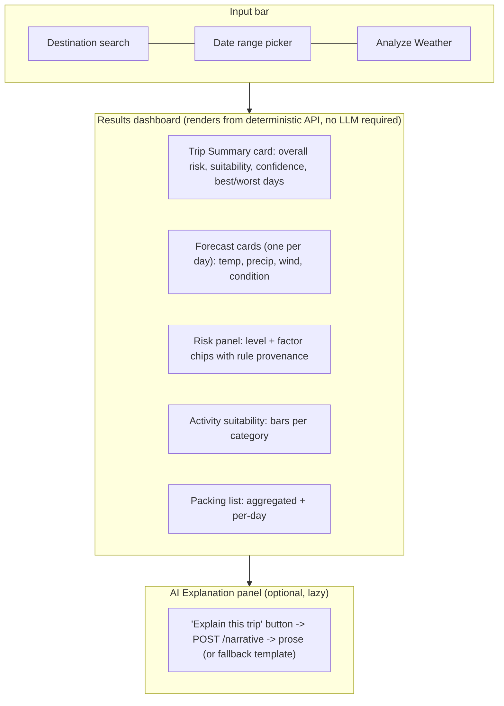

**Feature checklist (mapped to the brief, all served by the existing API):** destination search, travel-date selection, Analyze button, forecast cards, packing suggestions, travel risk, best days, worst days, activity suitability, trip summary, AI Explanation panel, responsive layout. **Note the AI Explanation panel is lazy and separate** — the dashboard is fully usable before it's ever clicked.

**Design discipline:** the frontend is a *presentation layer over the same contract TravelOS uses.* It must not push any requirement back into the API that a machine consumer wouldn't want. If the UI needs something the API doesn't have, question the UI before you change the contract.

**Stack:** React (Vite) or Next.js static export; component library optional; charts via a light lib (Recharts) for the activity/risk bars. Keep it minimal but polished — a clean dashboard reads as "senior" far more than a busy one.

## 26. AI Integration Strategy

**Naming — the rejected rename, in full.** The brief asked to rename `NarrationService` to **"Travel Advisor AI."** I'm rejecting it, and this is a deliberate architectural choice, not pedantry:

- Your **non-negotiable principle** is *the LLM narrates; it never decides.* An "Advisor" is, by definition, a thing that advises — i.e. decides and recommends. Naming the component "Travel Advisor AI" encodes into your architecture's vocabulary the exact responsibility you spent the whole design removing from the LLM.
- Names leak into behavior. Six weeks in, someone reads "Travel Advisor AI" and thinks "well, it *is* the advisor, so let it also pick the best day / adjust the risk / suggest activities." The boundary erodes through the name.
- A reviewer who reads "Travel Advisor AI" and then hears you say "but it never advises anything" will note the contradiction. The name works against your strongest talking point.

**Recommended name:** keep **`NarrationService`** as the code/architecture name (it says exactly what it does: it narrates). For the *product/UI* label, use **"AI Explanation"** — again, explanation, not advice. If you want something with a touch more polish than "Narration," **"Weather Narrator"** or **"Insight Narrator"** are acceptable; all of them describe *phrasing*, none imply *deciding*. That is the whole test a name has to pass here.

**How the LLM is used:**

- **Input:** a finished, deterministic `WeatherIntelligence` object. The LLM never sees raw weather and never computes.
- **Prompt shape:** a structured system prompt that says, in effect, "you are given computed travel-weather intelligence; render it as a short, friendly summary; do not add, change, or infer any number, ranking, or recommendation not present in the input." The intelligence object is passed as structured data, not prose.
- **Output:** free-text prose only, written into `narrative.summaryText`. It cannot write to any other field.
- **Failure handling:** timeout + circuit breaker on the LLM call. On failure/disable, `NarrationService` returns a **templated fallback** built deterministically from the same object ("Aug 4 is your best day; expect rain Aug 1; pack a waterproof jacket."), sets `fallbackUsed: true`, and the request still returns 200.
- **Feature flag:** the whole narration path is behind a flag. Flag off = the service is a pure deterministic engine, and every test still passes. That switch *is* the proof of the boundary.
- **Caching narration** (V2): key on the intelligence object's identity so identical trips don't re-invoke the LLM.

**Why no LangChain / vector DB here** (restated where it belongs): the interaction is one structured call over self-contained input. There is no retrieval, no memory, no multi-step tool use. A thin client behind the interface is clearer, cheaper, and keeps the boundary crisp. (§20 has the full rationale.)

## 27. TravelOS Integration Strategy

This service is one context input to TravelOS's planner — exactly as the reference code implies.

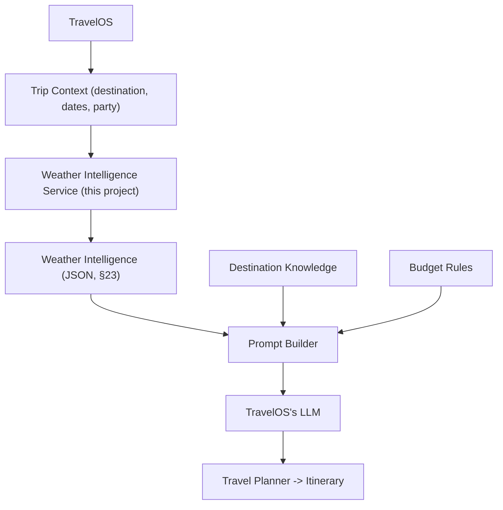

**Responsibility split (say this explicitly in the report):**

| Concern | Owner |
|---|---|
| What the weather *is* and what it *means for travel* (risk, suitability, packing, timing) | **This service** |
| Destination facts, attractions, POIs | TravelOS (Destination Knowledge) |
| Cost/pricing constraints | TravelOS (Budget Rules) |
| Combining all inputs into a prompt | TravelOS (Prompt Builder) |
| Generating the itinerary | TravelOS (its LLM) |

**Integration mechanics:** TravelOS needs nothing but an HTTP client and our OpenAPI spec. It calls `GET /intelligence`, receives the JSON, and folds the *structured* object (not our narrative) into its planner prompt. **No adapter on the TravelOS side, no change on ours** — provided the §23 schema stays stable. That zero-change property is your architecture's actual success metric; write it into the README as the "proof of design."

---

# PART VI — CROSS-CUTTING CONCERNS

## 28. Security

Right-sized for the scope; enterprise items named and deferred, not silently dropped.

- **AuthN (MVP):** API-key header auth. Full OAuth2/OIDC is enterprise-version scope (§42), named so a reviewer sees you know the difference.
- **Secrets:** provider keys and the LLM key via environment variables / a secrets file, never committed. `.env.example` in the repo, real `.env` git-ignored.
- **Input validation:** validate and canonicalize location and date parameters *before* they reach any provider call or the DB — reject malformed dates, absurd ranges, injection attempts at the edge (DTO/schema validation in the Interface layer).
- **Upstream protection:** rate limiting at the API layer protects both your service and your upstream provider quotas; per-external-call timeouts and circuit breakers so a slow/down dependency degrades a response instead of hanging it.
- **LLM-specific:** never log full prompts/responses if they could contain user-identifying trip context; cap prompt size; treat LLM output as untrusted text destined only for the `narrative` field (it can never reach a computed field, so prompt-injection cannot alter a decision — a genuinely nice property to point out in review).
- **Transport:** HTTPS only in any deployed environment.
- **Data:** raw readings and computed intelligence are non-personal; the only sensitive element is trip context in narration requests, handled by the logging rule above.

## 29. Scalability

**Scalable in *design*, not in deployed footprint — and that is the correct, honest answer for an internship project.** Because the engines are pure and stateless and all infrastructure sits behind interfaces, the following are *additions, not rewrites*: swapping in-memory cache for Redis, running multiple stateless API instances behind a load balancer, moving ingestion to a scheduled worker, adding a queue between ingestion and compute. Build none of it now. The point is that you haven't architected yourself *out of* being able to.

The reviewer question here is "what changes at 10,000 req/s, and what doesn't?" Your answer: the domain engines don't change at all (pure, stateless, horizontally trivial); the store and cache become the bottleneck and get Redis + read replicas + connection pooling; ingestion moves from on-miss to scheduled + queued so bursts don't stampede providers. Nothing in the *shape* changes — that's the payoff of the layering.

## 30. Performance

- **The deterministic path never blocks on the LLM.** This is the single most important performance property, and it's structural (separate endpoint), not tuned.
- **Cache-hit target:** an intelligence request served from the store returns well under a second; the engines are in-memory arithmetic over a handful of days — negligible compute.
- **Cache-miss cost** is dominated by the provider HTTP round-trip; bounded by a timeout and mitigated by caching so it's paid once per (location, date, freshness-window), not per request.
- **Narration latency** (seconds, LLM-bound) is isolated to the optional endpoint and cached (V2), so it never taxes the hot path.
- **Budgets to state in the report:** deterministic cache-hit p95 < 200 ms; cache-miss p95 bounded by provider-timeout + compute; narration p95 bounded by LLM-timeout with a hard ceiling and fallback.

## 31. Caching Strategy

Two levels, each with a distinct justification:

1. **Provider-response cache** — avoid re-fetching the same (location, date) within a short TTL. *Justification:* protects against provider rate limits and cost. Lives in the Ingestion Plane.
2. **Computed-intelligence cache** — avoid recomputing (and re-serving) identical intelligence. *Justification:* the hot path. Lives in the Serving Plane, keyed on (location, date-range, `ruleConfigVersion`) so a rule change correctly invalidates stale intelligence.

**Progression:** in-memory (MVP, sufficient to *demonstrate* both levels) → Redis (V2) when you need cross-instance sharing or real TTL/eviction control. **Invalidation is the hard part, so name it:** provider cache expires by TTL; intelligence cache expires by TTL *and* by `ruleConfigVersion` bump. The `narration_cache` (V2) is keyed on the intelligence identity it narrates. Being able to explain your invalidation triggers is worth more in review than the caching itself.

## 32. Testing Strategy

The domain is pure, so most of your value comes from cheap, fast, offline tests. Eleven test types, each with what it actually asserts:

| Type | What it tests | How |
|---|---|---|
| **Unit (domain)** | Insight + Recommendation engines: given weather X and rule config Y, output Z. Determinism. | Pure functions, no I/O, table-driven cases (dry day, storm day, borderline threshold). The core of the suite. |
| **Integration (API + DB)** | Use case → repository → Postgres round-trip; correct persistence and retrieval | Test DB (containerized Postgres or transactional rollback) |
| **API (HTTP)** | Endpoint contracts: status codes, response shape, versioning, error envelope | Supertest against the running app |
| **Provider adapter** | Each adapter correctly normalizes that provider's real response shape into the internal model | Recorded/fixture provider responses → assert normalized output |
| **Database** | Migrations apply cleanly; constraints, indexes, JSONB queries behave | Migration up/down tests, query assertions |
| **Prompt validation** | The narration prompt is well-formed and contains only the intended structured input | Snapshot the assembled prompt; assert no computed field is asked to be changed |
| **AI output validation** | LLM output is confined to `narrative`; it never mutates a computed field | Run narration over a fixed intelligence object; diff the object — only `narrative` may differ |
| **Fallback** | With the LLM disabled/failing, the templated fallback fires and the response is still valid 200 with `fallbackUsed: true` | Flag off + injected LLM failure |
| **Timeout** | Provider and LLM timeouts trigger circuit-breaker/fallback paths, not hangs | Simulated slow dependency |
| **Contract** | The §23 schema doesn't break consumers between versions | JSON-schema/contract test the intelligence object; fail the build on a breaking change |
| **Performance (light)** | Cache-hit path meets its latency budget; cache-miss is bounded | A small load check on the deterministic endpoint |

The two tests that most impress a reviewer are **AI output validation** (proves the boundary mechanically) and **fallback** (proves resilience). Write those first; they're your thesis in executable form. Aim for high coverage on `domain/` specifically — that's where correctness lives — and don't chase coverage on infrastructure glue.

## 33. Deployment Architecture

MVP-appropriate and honestly stated:

- **MVP:** single containerized service (Docker) + a Postgres instance (managed, or a second container). Deploy on any small platform — Fly.io, Railway, Render — or `docker-compose` for a local/demo environment. Environment-based secrets, HTTPS.
- **V2:** add Redis as a second container; add the static frontend as a separately-served SPA (or a CDN/static host).
- **No orchestration platform, no multi-region, no service mesh.** A single instance behind HTTPS with env secrets is the *entire* correct deployment story for this scope — that's the right answer, not a limitation. Say so explicitly; naming what you deliberately didn't deploy is itself a signal of judgment.

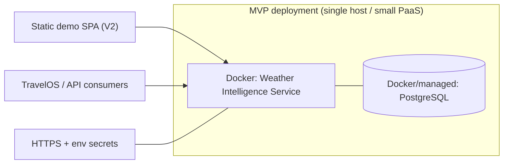

---

# PART VII — GOVERNANCE

## 34. Risks

| Risk | Likelihood | Impact | Mitigation |
|---|---|---|---|
| Over-engineering relative to internship scope | Medium | High (dilutes the thesis) | Every pattern/infra justified by a stated "why now" (§21, §20), reviewed against the out-of-scope list |
| Provider rate limits / cost | Medium | Medium | Two-level caching (§31), rate limiting, fallback chain |
| LLM latency, cost, or hallucinated narrative | Medium | Low (isolated) | Separate endpoint, timeout + circuit breaker, templated fallback, `fallbackUsed` flag |
| Scope creep toward full TravelOS | High | High | Explicit out-of-scope section (§11), enforced against every new feature idea |
| The frontend becoming the center of gravity | Medium | Medium | UI is a V2 presentation layer over the same contract (§25); backend engine is the graded artifact |
| Reviewer skepticism of unused infra (Redis/queues) | Medium | Low | Deferred to V2/V3 with explicit triggers, absent from MVP |
| Boundary erosion via naming ("Advisor") | Low now, higher over time | Medium | Rejected the "Advisor" name (§26); `NarrationService` keeps the boundary in the vocabulary |
| Non-determinism creeping into engines | Low | High | Determinism as an NFR + a unit test that asserts identical inputs → identical outputs |

## 35. Trade-offs (the honest ledger)

- **TypeScript over FastAPI:** chose ecosystem-match/portability over Python's nicer validation and your own ML-language comfort. Right call *because* portability into a TS platform is the success metric — but it's a real trade, not a free win.
- **On-miss ingestion over scheduled ingestion (MVP):** simpler, no worker process, but the first request for a cold (location, date) pays the provider round-trip. Acceptable at demo scale; scheduled ingestion is the V3 answer.
- **Postgres-as-cache over Redis (MVP):** one fewer moving part, at the cost of cache sophistication (no native TTL/eviction). Fine until you can point at a concrete latency or multi-instance reason.
- **Two engines over five:** less granular separation, but five near-empty classes would be over-abstraction. Chose demonstrable-separation over maximal-separation.
- **Optional narration over always-on AI:** a bit more code (interface + fallback path) for a system that's fully testable and demoable with AI off. The extra code *is* the boundary; it's worth it.
- **API-key auth over OAuth (MVP):** faster to build, less "enterprise," but honestly scoped and named as deferred.

## 36. Architecture Decision Records

**ADR-001 — LLM is narration-only, never decisional.**
*Context:* the reference TravelOS code treats the LLM as an itinerary generator fed deterministic inputs. *Decision:* restrict LLM usage to an isolated `NarrationService`, called by one use case, over already-computed data. *Consequences:* slightly more code (an interface + a fallback path) in exchange for a system fully testable and demoable with the LLM entirely disabled. *Status:* accepted.

**ADR-002 — PostgreSQL only for MVP; Redis deferred to V2.**
*Context:* both proposed early. *Decision:* no Redis until there's a concrete latency or multi-instance cache-sharing need. *Consequences:* simpler MVP infra; revisit when cache-hit-rate or response-time data justifies it. *Status:* accepted.

**ADR-003 — Split Ingestion and Serving planes instead of one linear pipeline.**
*Context:* the original diagram implied every request re-fetched from providers. *Decision:* serving reads from the Knowledge Store; ingestion runs on miss (MVP) or schedule (V3). *Consequences:* requires a cache-miss trigger path in the Orchestrator, but makes the caching/resilience story real instead of implied. *Status:* accepted.

**ADR-004 — No itinerary or attraction generation in this service.**
*Context:* the reference LLM generates itineraries; temptation to fold that in for "impressiveness." *Decision:* out of scope — this service outputs intelligence, not itineraries. *Consequences:* a smaller, sharper demo and a much stronger "I understood the boundary" story. *Status:* accepted.

**ADR-005 — Keep `NarrationService`; reject the "Travel Advisor AI" rename.**
*Context:* the brief requested renaming to "Travel Advisor AI." *Decision:* keep `NarrationService` (code) / "AI Explanation" (UI); "Advisor" implies a decision-making role that contradicts ADR-001. *Consequences:* the boundary stays encoded in the vocabulary; no contradiction for a reviewer to catch. *Status:* accepted.

**ADR-006 — No vector database and no LLM-orchestration framework (LangChain).**
*Context:* both appeared in the tech-evaluation brief. *Decision:* exclude both; the LLM receives a complete structured object (nothing to retrieve/embed) via a single structured call (nothing to orchestrate). *Consequences:* fewer dependencies, a crisper boundary, and a defensible "what would you even embed?" answer. *Status:* accepted.

**ADR-007 — TypeScript/Node.js over FastAPI/Python.**
*Context:* FastAPI is attractive (Pydantic, auto-OpenAPI) and matches the builder's ML background; TravelOS reference code is TypeScript. *Decision:* TypeScript, to eliminate a language seam at the integration boundary. *Consequences:* trades Python ergonomics for zero-friction portability into a TS platform — the stated success metric. *Status:* **superseded** — see Implementation & Development Guide §1.6: integration is over HTTP + OpenAPI (language-agnostic), so no seam exists; Python/FastAPI is the approved stack.

---

# PART VIII — PLANNING

## 37. Implementation Roadmap

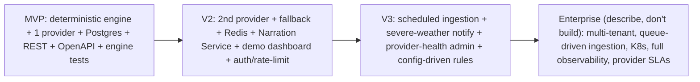

## 38. Sprint Plan (indicative, adjust to your internship calendar)

Assumes roughly two-week sprints; compress to weeks if your internship is short. The ordering is the point, not the exact durations.

- **Sprint 0 — Foundations.** Repo, folder structure (§19), DI wiring, config/feature-flags, CI, empty layer boundaries + a dependency lint rule enforcing "domain imports nothing from infrastructure." *Exit:* the skeleton compiles and the boundary is mechanically enforced.
- **Sprint 1 — Deterministic core.** Internal weather model; Insight Engine (rules → risk → scoring) and Recommendation Engine, fully unit-tested with fixtures, zero I/O. *Exit:* engines green offline; determinism test passes.
- **Sprint 2 — Ingestion + persistence.** One provider adapter (Open-Meteo), Provider Registry, Normalization Pipeline, Postgres repositories + migrations, Knowledge Store. *Exit:* a real (location, dates) flows provider → normalized → stored → computed.
- **Sprint 3 — Serving + API.** Orchestrator use cases, REST endpoints (§24), error envelope, OpenAPI spec, in-memory caching (both levels), integration + API tests. *Exit:* MVP is callable end-to-end and documented. **This is the MVP.**
- **Sprint 4 — Resilience + 2nd provider (V2 start).** Second adapter, fallback chain, timeouts/circuit breakers, provider-health endpoint, timeout/fallback tests.
- **Sprint 5 — Narration + demo UI (V2).** `NarrationService` behind a flag, templated fallback, narration cache, AI-output-validation + fallback tests; the demo dashboard (§25); API-key auth + rate limiting.
- **Sprint 6+ — V3 items** as time allows: scheduled ingestion, config-driven rule thresholds, severe-weather notify, provider-health admin view.

## 39. MVP Definition (the concrete deliverable list)

1. Two-plane architecture implemented as folder structure (§19), boundary enforced by a lint rule, even before all engines are complete.
2. One real provider adapter (Open-Meteo — free, no key, demo-friendly).
3. Insight Engine and Recommendation Engine, fully unit-tested with no I/O.
4. Postgres-backed Knowledge Store (raw readings + computed intelligence).
5. REST API with the §24 endpoints (the narrative endpoint may be a stub or absent in MVP — it is legitimately a V2 feature).
6. OpenAPI spec.
7. In-memory caching at both levels.
8. README documenting the architecture, the in/out-of-scope decision, and how this plugs into TravelOS.

**MVP is done when:** an unrelated HTTP client gets a valid, correct, documented `WeatherIntelligence` object for a real location and date range, and the engine test suite passes with the network unplugged.

## 40. Version 2

Second provider + fallback strategy; Redis caching (with the stated trigger); the `NarrationService` (isolated, feature-flagged, with templated fallback); the read-mostly demo dashboard; API-key auth + rate limiting; a historical-trend endpoint using stored raw readings.

## 41. Version 3

Scheduled/background ingestion (cron or worker) instead of on-demand only; severe-weather webhook/notification; a provider-health admin view; **rules moved to config** so thresholds are tunable without a redeploy (this is the change that makes the engine feel product-grade); optional narration caching maturity and multi-language narration.

## 42. Enterprise Vision (describe, don't build)

Multi-tenant with per-tenant provider config and quotas; queue-driven ingestion (Kafka/SQS) decoupling fetch from compute; Kubernetes with horizontal autoscaling on the stateless API; a full observability stack (metrics, tracing, dashboards, alerting); geo-distributed caching; contractual SLAs on provider fallback; a formal contract-test suite run against a live TravelOS instance; OAuth2/OIDC and RBAC. Each of these is real engineering that belongs to a different bounded context — naming them (and *not* building them) is itself the signal that you know where the line is.

## 43. Future Enhancements (beyond V3)

Config-driven rule thresholds a non-engineer can tune; a confidence score attached to narrative text so consumers know how much to trust the prose; multi-language narration; a plug-in mechanism for adding new activity-suitability categories without touching the Scoring Engine's core; typical-weather baselines and anomaly flags ("unusually hot for August") from the historical readings you're already storing.

---

# PART IX — REVIEW & SUCCESS

## 44. Mentor Review Questions (prepare crisp answers)

- Why Postgres and not Redis for the MVP? *(ADR-002)*
- What made you draw the line at "intelligence" instead of "recommendations that name actual attractions"? *(§11, ADR-004)*
- How did you decide what belonged in MVP vs V2? *(§37–40)*
- How would TravelOS actually call this service — concretely? *(§27; answer: HTTP client + OpenAPI, zero adapter, zero changes on our side)*
- Why did you *not* rename the AI component to "Advisor"? *(ADR-005 — and this is a great one to volunteer; it shows boundary discipline)*

## 45. Interview Questions (the ones this design lets you answer well)

- Why is the LLM behind its own service instead of inside the Decision Engine? *(§26, ADR-001)*
- Walk me through what happens when your primary weather provider is down mid-request. *(§16 ingestion diagram: fallback chain; if all fail, a degraded 200 with a `degraded` flag, never a hang)*
- How would you know if your cache-hit rate justified adding Redis? *(§31, ADR-002 — you'd instrument hit-rate and latency first)*
- What changes at 10,000 req/s, and what doesn't? *(§29 — engines don't change; store/cache/ingestion do)*
- Why didn't you build the itinerary feature — wasn't that the more impressive part of the reference code? *(§11, ADR-004 — bounded context; the impressive thing is the boundary, not the itinerary)*
- Prove the LLM never affects a decision. *(§32 AI-output-validation test: diff the object, only `narrative` may change)*

## 46. Project Success Criteria

- **Primary:** the `/intelligence` API can be called by an unrelated system with **zero modification** to this service, and the returned object is usable as-is. If this holds, the architecture holds.
- The domain engine test suite passes **with the network and LLM disabled.**
- Toggling the narration feature flag off changes **only** the `narrative` block of any response.
- Every risk/suitability score in a response **traces to a named rule.**
- A reviewer can state, in one sentence each, what the service does, what it deliberately doesn't, and how it would plug into TravelOS.
- No component, pattern, or piece of infrastructure lacks a one-line "why now" that isn't "best practice."

## 47. Final Project Blueprint (single source of truth)

- **Vision:** a standalone, provider-agnostic Weather Intelligence Service — deterministic core, optional LLM narration — designed to plug into a TravelOS-style planner as one context input.
- **Boundary:** produces intelligence (risk, suitability, packing, timing); never itineraries or named attractions.
- **Architecture:** two planes (Ingestion, Serving); four layers (Interface, Application, Domain, Infrastructure); dependencies point inward; domain imports nothing.
- **Core contract:** the Weather Intelligence object (§23) — every other document is written around it.
- **AI stance:** an isolated, optional `NarrationService` (never "Advisor"); narrates, never decides; fails soft to a templated fallback; behind a feature flag whose "off" state is a fully-working deterministic product.
- **Rejected on purpose:** itinerary/POI generation, chatbot UI, vector DB, LangChain, Redis-in-MVP, Kubernetes/queues/multi-region — each named, each deferred or excluded with a reason.
- **MVP:** §39, verbatim.
- **Success test:** an unrelated system calls the API with zero changes to this service.
- **Non-negotiable principle:** the LLM narrates; it never decides.

This document is the seed for: Product Vision, PRD, TRD, System Architecture Document, API Specification, Database Design, UI/UX Specification, Sprint Plan, Implementation Roadmap, Testing Strategy, Deployment Guide, README, presentation, and internship report. Generate each of those as a **view onto this blueprint**, not as an independent document — that is how they stay consistent, and consistency across artifacts is itself a senior signal.
