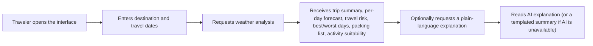
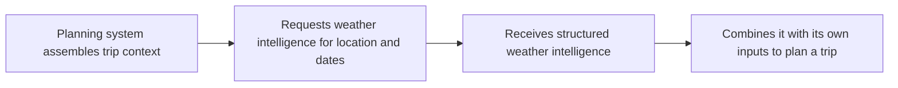

# Weather Intelligence Service — Product Requirements Document (PRD)

## 1. Document Information

| Field | Value |
|---|---|
| **Product** | Weather Intelligence Service |
| **Document type** | Product Requirements Document (PRD) |
| **Version** | 1.0 |
| **Status** | Draft for stakeholder / mentor review |
| **Date** | 21 July 2026 |
| **Owner** | Yogesh — AI/ML Intern, FlyRank |
| **Source of truth** | Weather Intelligence Service — Project Bible v1.0 |
| **Audience** | Product managers, mentor, platform stakeholders |
| **Scope of this document** | Product intent, users, problems, functionality, and scope. Architecture, APIs, data design, technology choices, and deployment are covered separately in the Technical Design Document (TRD). |

This PRD is a product-level view onto the Project Bible. It introduces no new features, technologies, or scope beyond the Bible. Where the Bible interleaves product and technical detail, this document extracts only the product layer.

---

## 2. Executive Summary

The Weather Intelligence Service is a standalone product that turns raw weather forecasts into decision-ready travel intelligence. Instead of answering *"what will the weather be,"* it answers *"how does the weather affect my trip"* — producing per-day and whole-trip assessments of travel risk, activity suitability, packing needs, and the best and worst days to travel.

The product is deliberately narrow. It is not a trip planner, an itinerary generator, or a chatbot. It is one well-bounded component that a larger travel-planning platform (referred to throughout as TravelOS) can consume as a single, reliable input. All intelligence is produced by deterministic, explainable logic; an optional AI layer restates that intelligence in plain language but never computes, ranks, or decides anything. The product must remain fully functional with the AI layer switched off.

Its defining success condition is portability: an unrelated system can call the service and receive usable intelligence with no changes required to the service itself.

---

## 3. Product Vision

A provider-agnostic Weather Intelligence Service that ingests weather data, derives travel-relevant intelligence through explainable rules, and exposes it in a stable, consumable form — designed so that a larger AI trip-planning system can use it as one context input among several, without modification.

The value the product demonstrates is not weather data itself, but the *translation* of weather into travel decisions, delivered as a reusable service with a clearly defined boundary.

---

## 4. Problem Statement

Weather APIs report conditions; they do not interpret them for travel. A traveler or a planning system is left to answer, on their own, the questions that actually matter: Is this a good day for the beach? What should I pack? Is this trip riskier than usual? Which of these five days should host the outdoor activity?

Today this translation is handled in one of two unsatisfactory ways:

- **Raw data handed to an AI model**, which is unauditable, non-reproducible, and prone to fabrication.
- **Weather rules hard-coded inside an application**, which is not reusable across products and not testable in isolation.

Neither produces a reusable, provider-agnostic, explainable service. This product fills that gap: every assessment traces back to a stated rule, and the output is a stable contract any consumer can depend on.

---

## 5. Business Objectives

| ID | Objective | Description |
|---|---|---|
| BO-1 | Demonstrate bounded-context discipline | Deliver a product with a clearly defined boundary and an explicit out-of-scope list that any reviewer can restate in one sentence. |
| BO-2 | Deliver explainable, reproducible intelligence | All travel assessments are produced by deterministic logic and are traceable to rules, not to a model's opinion. |
| BO-3 | Use AI in a restrained, auditable way | The AI layer is optional and non-authoritative; the full product works without it. |
| BO-4 | Produce a consumable product contract | The intelligence output is stable enough for an external system to consume without adaptation. |
| BO-5 | Remain appropriately scoped | Every capability is justifiable within an internship-sized effort; nothing is included merely to appear impressive. |

---

## 6. Success Metrics

| Metric | Target |
|---|---|
| **Consumability** | An unrelated system can obtain usable intelligence for a location and date range with zero changes to the service. |
| **Determinism** | Identical inputs always produce identical intelligence output. |
| **AI isolation** | Disabling the AI narration layer changes only the plain-language explanation, never any assessment, score, or ranking. |
| **Explainability** | Every risk and suitability result is traceable to a named rule. |
| **Boundary clarity** | A reviewer can state, in one sentence each, what the product does, what it deliberately does not do, and how it would integrate with a larger platform. |
| **Resilience (perceived)** | A weather-provider or AI outage results in a degraded-but-valid response, never a failure. |
| **Responsiveness (perceived)** | Repeat requests for previously analyzed trips feel near-instant; the assessment is never delayed by the AI narration step. |

---

## 7. Stakeholders

| Stakeholder | Interest | Primary evaluation focus |
|---|---|---|
| Intern (product owner) | Learning, a strong portfolio artifact | Whether the product shows judgment, not just output |
| Mentor | Correct interpretation of the reference architecture and boundary | Scope discipline, the deterministic/AI split, integration clarity |
| Platform team (future TravelOS) | Whether the module can be consumed cleanly | Contract stability, resilience |
| Reviewers / interviewers | Ability to reason about trade-offs | Decision rationale, scoping choices |
| End traveler (indirect) | Actionable, trustworthy weather guidance | Explainability, correctness, graceful degradation |
| Weather data providers (upstream) | Fair use of their service | Responsible request volume and fallback behavior |

The mentor and reviewers are the primary evaluators; both assess judgment above output.

---

## 8. User Personas

**Priya — the Weekend Traveler (end-user, via the demo interface).**
Planning a short trip and wants to know which days are safe for her intended activities, what to pack, and whether to be concerned — in plain language, in seconds. She wants to enter a place and dates and receive a clear dashboard, not to hold a conversation.

**TravelOS Planner — the Machine Consumer (primary user).**
An AI trip-planning system that requests weather intelligence for a location and date range and folds the structured result into its own planning process, alongside other inputs. It cares about contract stability, responsiveness, and resilience. It never uses the human interface.

**Deepak — the Integrating Engineer (platform team).**
Responsible for connecting the larger platform to this service. He needs the product's behavior and contract to match its documentation exactly, with well-behaved failures and an optional (never required) explanation field. His measure of success is "no surprises."

**Mentor / Reviewer (evaluator).**
Assesses whether the boundaries and decisions are sound and consistently reasoned. Success is that every design question already has a written, consistent answer.

> The **primary user is the machine consumer.** The human interface serves Priya, but the product contract is designed for the Planner. Interface convenience must never distort the product contract.

---

## 9. User Journey

Two journeys share the same underlying product. Both are shown at the product level; the mechanics that fulfill them are described in the TRD.

**Human journey (demo interface):**

The full analysis is available before, and independently of, the optional explanation. If the AI layer is unavailable, the traveler still receives the complete assessment.

**Machine journey (planning system):**

The planning system consumes the structured intelligence directly and does not use the plain-language explanation.

---

## 10. Product Scope

The product provides the following capabilities:

- Retrieve current and forecast weather for a location and date range from external providers.
- Present weather in one consistent form, independent of which provider supplied it.
- Produce **per-day intelligence**: a weather summary, an overall risk level with contributing factors, activity-suitability scores across a fixed set of activity categories, packing recommendations, and a travel advisory.
- Produce **trip-level intelligence**: best day(s), worst day(s), an aggregated packing list, an overall risk level, a trip-suitability score, and a forecast-confidence indicator.
- Optionally produce a **plain-language explanation** of the assessment, which never alters any computed value.
- Make all intelligence available to external consumers through a stable product contract.
- Reduce redundant requests to weather providers so repeat analyses are fast and provider usage is respectful.
- Degrade gracefully when a weather provider or the AI layer is unavailable.
- Report weather-provider availability for diagnostic purposes.
- Provide a focused demonstration interface (a later release) that presents the intelligence to human users.

---

## 11. Out of Scope

The following are explicitly **not** part of the product. Stating these is as important as stating what is included.

| Excluded capability | Rationale |
|---|---|
| Itinerary generation | Belongs to the larger planning platform, not this module. |
| Named attraction / point-of-interest recommendation | Belongs to the platform's destination-knowledge capability. |
| Chatbot or open-ended conversational interface | The product answers structured travel-weather questions, not free-form dialogue. |
| Trip budgeting or pricing logic | Belongs to the platform's budgeting capability. |
| Custom-built weather forecasting | The product consumes provider forecasts; it does not create its own. |
| Multi-tenant accounts, billing, or single sign-on | Not required for the product's purpose or scope. |

The AI layer is also explicitly limited: it explains existing intelligence and never calculates, ranks, recommends, or decides. Any use of AI to produce assessments is out of scope.

*(Technology and deployment exclusions — for example, specific databases, AI frameworks, and infrastructure platforms — are decisions recorded in the TRD, not product-scope decisions, and are therefore not listed here.)*

---

## 12. Functional Requirements

All functional requirements trace directly to the Project Bible.

| ID | Requirement | Source |
|---|---|---|
| FR-1 | Retrieve current and forecast weather for a location and date range from at least one external provider (a second provider is added in a later release). | Bible §8 |
| FR-2 | Present provider weather in one consistent internal form, independent of the source provider. | Bible §8 |
| FR-3 | Retain raw weather readings and computed intelligence. | Bible §8 |
| FR-4 | Produce per-day intelligence: weather summary; risk level with contributing factors; activity-suitability scores for a fixed set of activity categories; packing recommendations; travel advisory. | Bible §8, §23 |
| FR-5 | Produce trip-level intelligence: best day(s), worst day(s), aggregated packing list, overall risk level, trip-suitability score, and forecast-confidence indicator. | Bible §8, §23 |
| FR-6 | Optionally produce a plain-language explanation of the assessment without altering any computed value. | Bible §8, §26 |
| FR-7 | Make all intelligence available to external consumers through a stable, versioned product contract. | Bible §8, §24 |
| FR-8 | Avoid redundant provider requests for previously analyzed locations and dates within a freshness window. | Bible §8, §31 |
| FR-9 | Degrade gracefully when a weather provider or the AI layer is unavailable, always returning a valid response. | Bible §8, §9 |
| FR-10 | Report weather-provider availability. | Bible §8 |

---

## 13. Non-Functional Requirements

These describe product qualities. How each is achieved is defined in the TRD.

| ID | Quality | Requirement |
|---|---|---|
| NFR-1 | Explainability | Every risk and suitability result must be traceable to a named rule. |
| NFR-2 | Determinism | Identical inputs must always produce identical intelligence. |
| NFR-3 | Resilience | Provider or AI outage must degrade gracefully and never cause a failed request. |
| NFR-4 | AI isolation | The AI explanation must be optional; the product must be fully usable with it disabled, and its absence must never affect any computed value. |
| NFR-5 | Extensibility | Adding a new weather provider or a new activity-suitability rule must not require reworking the product's core behavior. |
| NFR-6 | Portability | The product must be consumable by an unrelated system without modification to the product. |
| NFR-7 | Responsiveness | Repeat requests for previously analyzed trips must feel near-instant; the assessment must never wait on the AI explanation step. |
| NFR-8 | Observability | Product behavior (including provider and AI outcomes) must be observable enough to explain what happened during any request. |

---

## 14. User Stories

Each story traces to one or more functional requirements.

**Machine consumer (primary):**
- As a planning system, I want to request weather intelligence for a location and date range so that I can incorporate travel-weather insight into my own planning. *(FR-1, FR-4, FR-5, FR-7)*
- As a planning system, I want the intelligence to arrive in a stable, predictable form so that I can consume it without adapting to changes. *(FR-7, NFR-6)*
- As a planning system, I want a valid response even when a weather provider is unavailable so that my planning is not blocked. *(FR-9, NFR-3)*

**End traveler (via demo interface):**
- As a traveler, I want to enter my destination and dates and see how the weather affects my trip so that I can plan around it. *(FR-4, FR-5)*
- As a traveler, I want to know the best and worst days and what to pack so that I can schedule activities and prepare. *(FR-5)*
- As a traveler, I want to understand *why* a day is risky so that I can trust the assessment. *(NFR-1)*
- As a traveler, I want an optional plain-language summary so that I can read the assessment without interpreting scores myself. *(FR-6)*

**Integrating engineer:**
- As an integrating engineer, I want the product to behave exactly as documented so that I can connect it without surprises. *(FR-7, NFR-6)*
- As an integrating engineer, I want the plain-language explanation to be optional so that my integration never depends on the AI layer. *(FR-6, NFR-4)*

**Evaluator:**
- As a reviewer, I want to confirm the AI layer never influences an assessment so that I can trust the product's core logic. *(NFR-2, NFR-4)*

---

## 15. Product Features

| Feature | Description | Availability |
|---|---|---|
| Weather retrieval | Current and forecast weather for a location and date range. | MVP |
| Consistent weather presentation | Provider-independent, uniform weather form. | MVP |
| Per-day travel intelligence | Summary, risk level and factors, activity suitability, packing, advisory. | MVP |
| Trip-level intelligence | Best/worst days, aggregated packing, overall risk, trip-suitability score, forecast-confidence indicator. | MVP |
| Consumable product contract | Stable interface for external consumers. | MVP |
| Fast repeat responses | Cached analysis for previously seen trips. | MVP |
| Graceful degradation | Valid responses during provider or AI outages. | MVP |
| Provider availability reporting | Visibility into provider health. | MVP |
| Plain-language explanation | Optional AI narration of the assessment. | Later release |
| Multiple weather providers with fallback | Second provider and automatic fallback. | Later release |
| Demonstration interface | Focused dashboard presenting the intelligence to humans. | Later release |
| Historical weather trends | Comparisons against typical conditions, using retained data. | Future |

---

## 16. Assumptions

- At least one external weather provider is available and supplies forecast data for the requested locations and date ranges.
- Provider forecast data is sufficient to derive the required intelligence (temperature, precipitation, wind, and general conditions).
- The set of activity categories used for suitability scoring is fixed and known in advance.
- Forecast reliability decreases as the forecast horizon lengthens; the forecast-confidence indicator reflects this.
- The AI explanation layer is a convenience, not a dependency; consumers can and sometimes will operate without it.
- The product operates at demonstration scale, not at production traffic volumes.
- The larger platform (TravelOS) owns trip planning, itineraries, destination knowledge, and budgeting; this product supplies only weather intelligence.

---

## 17. Constraints

- **Deterministic core is mandatory.** All assessments must come from explainable rules; AI may not produce or alter any assessment.
- **Internship-sized effort.** Scope, features, and timeline must remain achievable within the internship; nothing is included solely to appear more advanced.
- **Provider usage limits.** External providers impose request limits and costs; the product must minimize redundant requests.
- **Stable contract.** Once external consumers depend on the intelligence output, its form must remain stable across changes.
- **Boundary integrity.** The product must not expand into itinerary planning, attraction recommendation, budgeting, or conversational AI.

---

## 18. Risks

| Risk | Impact | Mitigation (product-level) |
|---|---|---|
| Scope creep toward full trip planning | High | A firm, documented out-of-scope list, reviewed against every new idea. |
| Over-building beyond internship scope | High | Every feature must be justifiable; nothing included only to impress. |
| Provider unavailability or usage limits | Medium | Cached results, provider fallback, and graceful degradation. |
| AI producing incorrect or untrustworthy explanations | Low (isolated) | AI is optional, non-authoritative, and separated from all assessments; a templated summary replaces it on failure. |
| The demonstration interface becoming the product's focus | Medium | The interface is a later-release presentation layer over the same contract; the intelligence engine remains the core deliverable. |
| Erosion of the deterministic boundary over time | Medium | Naming and product rules that keep the AI layer explicitly explanatory, never advisory. |

---

## 19. MVP Definition

The Minimum Viable Product delivers the deterministic core and its consumable contract:

- Weather retrieval for a location and date range from one external provider.
- Per-day intelligence: summary, risk level and factors, activity suitability, packing, advisory.
- Trip-level intelligence: best/worst days, aggregated packing, overall risk, trip-suitability score, forecast-confidence indicator.
- A stable, documented product contract usable by an external consumer.
- Fast repeat responses for previously analyzed trips.
- Graceful degradation on provider unavailability.

The plain-language explanation, a second provider with fallback, and the demonstration interface are **not** required for the MVP; they are later-release features.

**The MVP is complete when** an external consumer can obtain valid, correct, documented weather intelligence for a real location and date range, and the assessments remain identical for identical inputs.

---

## 20. Future Enhancements

**Next release:**
- Optional plain-language explanation of the assessment.
- A second weather provider with automatic fallback.
- A focused demonstration interface presenting the intelligence to human users.
- Provider availability reporting surfaced for operational visibility.
- Historical-trend comparisons using retained weather data.

**Beyond that:**
- Configurable rule thresholds that non-engineers can tune without a release.
- A confidence indicator attached to the plain-language explanation.
- Explanations in multiple languages.
- New activity-suitability categories added without disturbing existing behavior.
- "Unusually hot/cold for the season" anomaly flags derived from retained data.

---

## 21. Acceptance Criteria

The product is accepted when:

- **AC-1** — An external consumer obtains valid weather intelligence for a real location and date range with no changes required to the product. *(FR-7, NFR-6)*
- **AC-2** — Identical inputs produce identical intelligence on every request. *(NFR-2)*
- **AC-3** — Disabling the AI explanation changes only the explanation text, and no assessment, score, or ranking. *(FR-6, NFR-4)*
- **AC-4** — Every risk and suitability result can be traced to a named rule. *(NFR-1)*
- **AC-5** — A weather-provider outage yields a degraded-but-valid response rather than a failure. *(FR-9, NFR-3)*
- **AC-6** — Per-day and trip-level intelligence include all required elements defined in FR-4 and FR-5.
- **AC-7** — Repeat requests for a previously analyzed trip return without re-requesting provider data within the freshness window. *(FR-8, NFR-7)*
- **AC-8** — A reviewer can state, in one sentence each, what the product does, what it excludes, and how it integrates with the larger platform. *(BO-1, BO-5)*

---

## 22. Glossary

| Term | Definition |
|---|---|
| **Weather Intelligence** | Decision-ready travel guidance derived from weather data: risk, activity suitability, packing, and timing, at per-day and trip level. |
| **Deterministic core** | The rule-based logic that produces all assessments; given the same inputs, it always yields the same output. |
| **Risk level** | A per-day or trip-level categorization (e.g., low / moderate / high) of how disruptive or hazardous conditions are for travel. |
| **Risk factor** | A specific, named contributor to a risk level (e.g., heavy rain), each traceable to a rule. |
| **Activity suitability** | A score indicating how appropriate conditions are for a given activity category on a given day. |
| **Trip-suitability score** | A trip-level measure of how good the overall trip is for its likely activities. |
| **Overall risk level** | A trip-level, worst-case framing of how risky the trip could be. |
| **Travel confidence (forecast confidence)** | An indicator of how much to trust the assessment, reflecting forecast horizon and data quality. Longer-range forecasts carry lower confidence. |
| **Travel advisory** | A short per-day guidance signal (e.g., proceed / caution) summarizing the day's assessment. |
| **Narration / plain-language explanation** | An optional, AI-generated restatement of the assessment in natural language; it never computes or changes any value. |
| **Provider** | An external source of weather data consumed by the product. |
| **Fallback** | Switching to an alternate provider (or a templated explanation) when a primary source is unavailable. |
| **Graceful degradation** | Returning a valid, reduced response when a dependency is unavailable, rather than failing. |
| **Product contract** | The stable, documented form in which weather intelligence is exposed to consumers. |
| **TravelOS** | The larger AI trip-planning platform that this product is designed to integrate with as one input. |
| **MVP** | The minimum set of capabilities that delivers the deterministic core and its consumable contract. |

---

*This PRD is derived entirely from the Weather Intelligence Service Project Bible v1.0 and introduces no new scope. Technical design, interfaces, data, technology, and deployment are specified in the accompanying TRD.*
