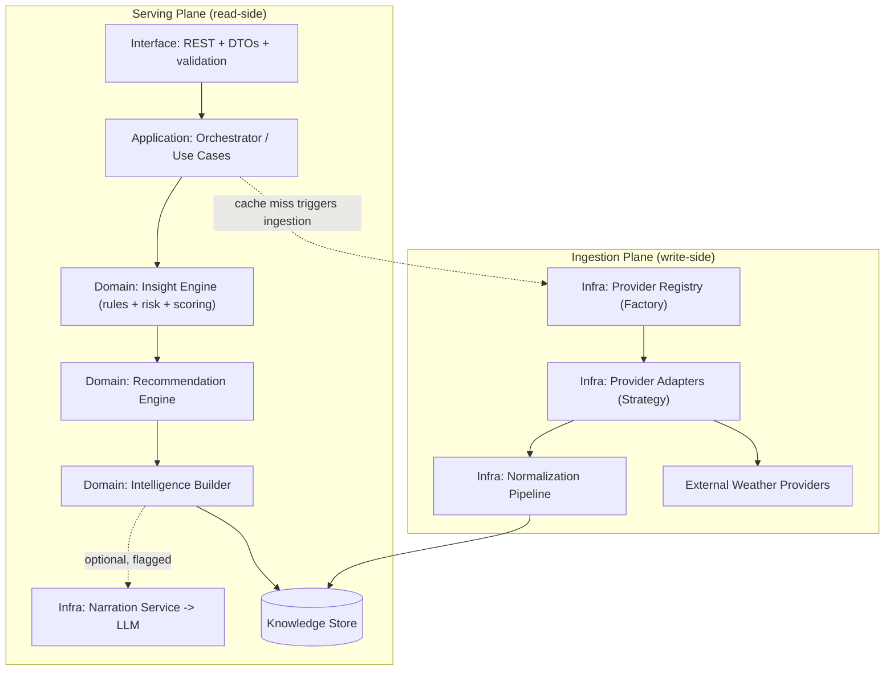
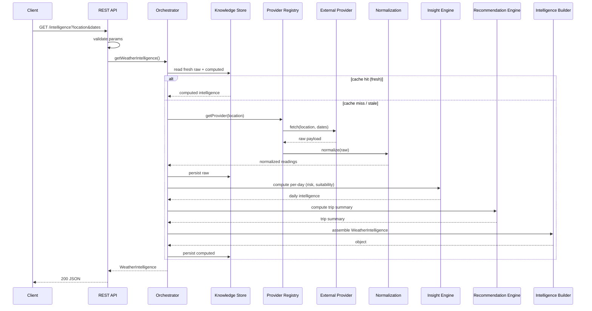
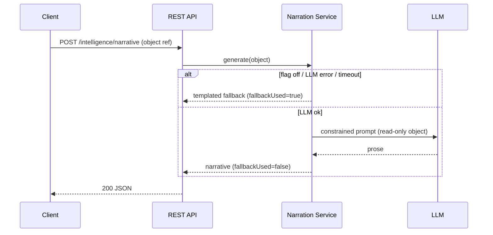
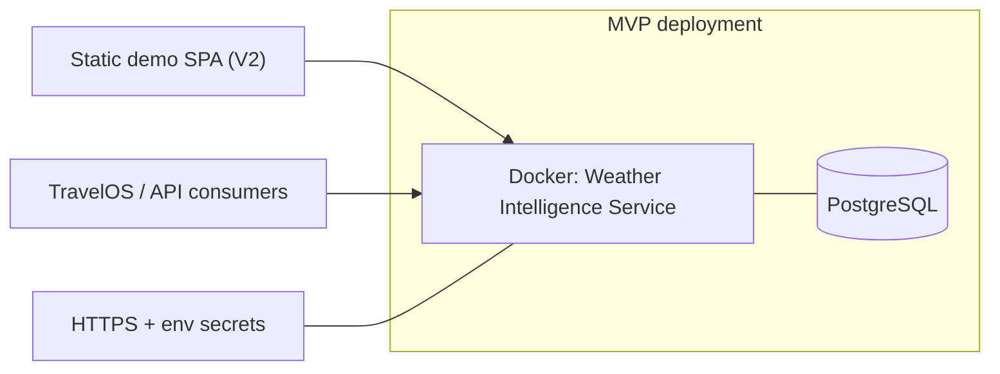

# Weather Intelligence Service — Technical Requirements Document (TRD)

## 1. Document Information

| Field | Value |
|---|---|
| **Document type** | Technical Requirements Document (TRD) — implementation blueprint |
| **Version** | 1.0 |
| **Status** | Draft for engineering / architecture review |
| **Date** | 21 July 2026 |
| **Author** | Yogesh — AI/ML Intern, FlyRank |
| **Related documents** | Weather Intelligence Service — Project Bible v1.0 (canonical); Product Requirements Document v1.0 (product view) |
| **Source of truth** | Project Bible **>** PRD. On any conflict, the Bible governs. This TRD invents no feature, API, module, technology, workflow, infrastructure, or business logic beyond the Bible. |
| **Purpose** | Define *how* the service is designed, built, integrated, validated, deployed, and maintained. |
| **Intended audience** | Backend engineers, AI engineers, technical leads, architecture reviewers, mentor. |

This TRD is the implementation view. Product intent (why the product exists, personas, scope) lives in the PRD and is referenced, not repeated. Architectural rationale established in the Bible is summarized where it drives an implementation decision, not restated in full.

---

## 2. Technical Overview

**Technical purpose.** Expose a versioned REST service that converts raw provider weather into a deterministic `WeatherIntelligence` object (risk, activity suitability, packing, best/worst days) for a location and date range, with an optional AI narration of that object.

**Service responsibilities.**

1. Ingest weather from pluggable external providers and normalize it to one internal model.
2. Persist raw readings and computed intelligence.
3. Compute per-day and trip-level intelligence deterministically from rule config.
4. Serve intelligence over a stable, versioned REST contract.
5. Optionally narrate a finished intelligence object in natural language, isolated behind a feature flag.
6. Cache to protect provider quotas and the hot path; degrade gracefully on any dependency failure.

**Design philosophy (the constraints every decision below serves).**

| Principle | Implementation consequence |
|---|---|
| Deterministic core is the product | All scores/ranks/recommendations come from pure functions over `(weather, ruleConfig)`; no I/O, no randomness, no LLM. |
| Clean Architecture (dependencies point inward) | `domain/` imports nothing from `infrastructure/`; enforced by a dependency-lint rule in CI. |
| AI narrates, never decides | Narration reads a finished object and writes only `narrative`; enforced by an AI-output test that diffs the object. |
| Two planes (Ingestion / Serving) | Serving reads the store; ingestion runs on cache-miss (MVP) or schedule (V3). Not every request re-fetches. |
| Fail soft | Every external call is bounded by a timeout + circuit breaker with a defined fallback. |

**Deterministic architecture & AI boundary (the non-negotiable).** The `narrative` field is the *only* field an LLM may write. Every other field is produced by the Insight and Recommendation engines and is reproducible for identical inputs. With the narration flag off, the service is a complete deterministic product and the full test suite passes. This boundary is structural (separate module, separate endpoint, separate test), not a convention.

---

## 3. Overall System Architecture

**Style.** Layered (Clean Architecture) monolith, split into two logical planes sharing one persistence boundary. A monolith is correct at this scope: no network hops between components, one deployable, trivially testable. The layering — not service decomposition — is what carries the extensibility story.

**Layers and dependency direction.**

| Layer | Contents | May depend on |
|---|---|---|
| Interface | REST controllers, DTOs, request validation, error mapping | Application only |
| Application | Orchestrator use cases (`GetWeatherIntelligence`, `GetBestDays`, `GetPackingList`, `GenerateNarrative`) | Domain interfaces only |
| Domain | Insight Engine, Recommendation Engine, Intelligence Builder, entities/value objects, ports | Nothing (pure) |
| Infrastructure | Provider adapters, Provider Registry, Normalization, Postgres repositories, cache client, LLM client | Domain interfaces (implements them) |

**Why inward dependencies:** the domain is the asset under evaluation and the thing that must be unit-testable with the network unplugged. If the domain imported a repository or an HTTP client, that property would be lost. Infrastructure implementing domain-defined ports is what makes providers, cache, and LLM swappable without touching business logic.

**Service boundaries.**
- The service owns weather → travel-intelligence translation only. It does **not** own itineraries, POIs, budgeting, or destination knowledge (PRD §11).
- The only shared component between planes is the Knowledge Store.
- The Orchestrator is the sole component that knows execution *order*; nothing else calls out of sequence.

**Internal workflow (summary; full lifecycle in §5).** A request enters the Interface layer, is validated, and handed to an Application use case. The use case reads the Knowledge Store; on a fresh hit it runs the engines (or returns cached intelligence), on a miss it triggers ingestion, then computes. The Intelligence Builder assembles the response. Narration, if requested, is a separate call.

---

## 4. Component Design

**Component summary.**

| Component | Layer | Purpose | Pattern |
|---|---|---|---|
| REST API Layer | Interface | Accept requests, validate, map to use cases, shape responses/errors | — |
| Orchestrator | Application | Sequence the read/compute/build flow; the only order-aware component | Use-case / Facade |
| Weather Provider Layer (Adapters) | Infrastructure | Fetch + translate one external API into the internal model | Strategy / Adapter |
| Provider Registry | Infrastructure | Select active provider and fallback chain | Factory |
| Normalization Layer | Infrastructure | Validate + normalize raw provider payloads | — |
| Knowledge Store | Infrastructure | Persist raw readings + computed intelligence behind a domain port | Repository |
| Insight Engine | Domain | Per-day rules → risk → activity scoring | Pure functions |
| Recommendation Engine | Domain | Trip-level best/worst days, packing, aggregate scores | Pure functions |
| Intelligence Builder | Domain | Assemble the `WeatherIntelligence` object | Builder |
| Narration Service | Infrastructure | Optional NL restatement of a finished object | Adapter (behind a domain port) |

Detailed contracts per component follow. I/O is described at the type level, not as code.

### 4.1 REST API Layer
- **Responsibilities:** route requests; validate/parse DTOs; invoke the correct use case; serialize responses; map errors to the standard envelope and status codes.
- **Inputs:** HTTP requests (location id, date range, optional narration request).
- **Outputs:** JSON responses (intelligence, best-days, packing, narrative, provider health) or a structured error envelope.
- **Dependencies:** Application use cases only. No domain logic, no data access.
- **Interactions:** one use case per endpoint.
- **Implementation notes:** keep controllers thin — no branching business logic; validation is schema-driven at this boundary so malformed input never reaches a provider or the DB.

### 4.2 Orchestrator (Use Cases)
- **Responsibilities:** own the execution order (read store → compute or trigger ingestion → build); decide cache-hit vs miss; coordinate optional narration in the `GenerateNarrative` use case only.
- **Inputs:** validated request parameters from the Interface layer.
- **Outputs:** a finished `WeatherIntelligence` object (or sub-view) to the Interface layer.
- **Dependencies:** domain ports (`WeatherRepository`, engines) and infrastructure via DI — never concrete infrastructure classes.
- **Interactions:** Knowledge Store (read), Provider Registry (trigger ingestion on miss), engines (compute), Builder (assemble), Narration Service (only in `GenerateNarrative`).
- **Implementation notes:** the *only* place allowed to call `NarrationService`; this containment is what keeps AI isolation enforceable.

### 4.3 Weather Provider Layer (Adapters)
- **Responsibilities:** implement the `WeatherProvider` port; call one external API; translate its response shape into the internal weather model.
- **Inputs:** location + date range.
- **Outputs:** normalized internal readings (or a typed provider error).
- **Dependencies:** the external provider API; the `WeatherProvider` port.
- **Interactions:** invoked by the Registry; hands raw payloads to Normalization.
- **Implementation notes:** one adapter per provider; the adapter is the *only* place that knows a provider's dialect. MVP ships one adapter (Open-Meteo); a second is added in V2 to prove the abstraction.

### 4.4 Provider Registry
- **Responsibilities:** construct and return the active adapter and the ordered fallback chain; hold provider priority and active state.
- **Inputs:** location context / configuration.
- **Outputs:** a provider adapter, or a fallback chain iterator.
- **Dependencies:** provider adapters; provider config/health.
- **Interactions:** called by the Orchestrator on cache-miss; drives fallback on adapter failure.
- **Implementation notes:** Factory pattern; fallback ordering is naturally a Chain of Responsibility (V2) once a second provider exists.

### 4.5 Normalization Layer
- **Responsibilities:** validate raw provider payloads; map provider-specific fields to the internal model; reject/flag incomplete data.
- **Inputs:** raw provider payload.
- **Outputs:** normalized readings ready for persistence and compute.
- **Dependencies:** none beyond the internal model.
- **Interactions:** sits between adapters and the Knowledge Store on the ingestion plane.
- **Implementation notes:** completeness of normalized data feeds the `travelConfidence` computation (§7.5) — record which fields were present.

### 4.6 Knowledge Store
- **Responsibilities:** persist and retrieve raw readings and computed daily intelligence behind the `WeatherRepository` port; expose freshness metadata.
- **Inputs:** normalized readings; computed intelligence; query by (location, date-range).
- **Outputs:** stored records; freshness-checked reads.
- **Dependencies:** PostgreSQL.
- **Interactions:** written by the ingestion plane; read by the serving plane. The only cross-plane component.
- **Implementation notes:** Repository pattern hides SQL from the domain; stores `ruleConfigVersion` on computed rows so a rule change invalidates the right intelligence. Postgres doubles as the MVP intelligence cache via freshness check (§7.4).

### 4.7 Insight Engine (Domain)
- **Responsibilities:** per day — evaluate rule thresholds (Rules), aggregate into a risk level + factors (Risk), compute activity-suitability scores (Scoring).
- **Inputs:** normalized daily weather + rule config.
- **Outputs:** per-day `RiskAssessment` + `activitySuitability[]`.
- **Dependencies:** none (pure).
- **Interactions:** consumed by the Recommendation Engine and Builder.
- **Implementation notes:** Rules/Risk/Scoring are modules inside *one* engine, not three services. Every factor carries the rule id that produced it (explainability, NFR-1).

### 4.8 Recommendation Engine (Domain)
- **Responsibilities:** across the date range — rank best/worst days, aggregate the packing list, compute trip-level aggregates (`overallRiskLevel`, `tripSuitabilityScore`, `travelConfidence`).
- **Inputs:** the collection of per-day Insight outputs + trip metadata (horizon, provider agreement, data completeness).
- **Outputs:** the `tripSummary` block.
- **Dependencies:** none (pure). Consumes Insight output — must run after it.
- **Interactions:** feeds the Builder.
- **Implementation notes:** must not re-derive per-day risk; it composes Insight output. This ordering is a hard dependency, not a suggestion.

### 4.9 Intelligence Builder (Domain)
- **Responsibilities:** assemble the full `WeatherIntelligence` object (per-day + trip summary + metadata) from engine outputs; attach an empty/absent `narrative` block.
- **Inputs:** per-day Insight outputs, trip summary, provider/metadata context.
- **Outputs:** a complete, narration-free `WeatherIntelligence` object.
- **Dependencies:** domain entities only.
- **Interactions:** returns to the Orchestrator; its output is the read-only input to Narration.
- **Implementation notes:** the object it produces is the stable consumer contract (§7.5). It never calls the LLM.

### 4.10 Narration Service (Infrastructure, optional)
- **Responsibilities:** implement the `NarrationService` port; send a finished object to the LLM with a constrained prompt; return prose for `narrative.summaryText`; fail soft to a deterministic template.
- **Inputs:** a finished `WeatherIntelligence` object.
- **Outputs:** `narrative` block only (`summaryText`, `modelUsed`, `fallbackUsed`, `generatedByLLM`).
- **Dependencies:** hosted LLM API; feature flag; the `NarrationService` port.
- **Interactions:** called only by `GenerateNarrative`.
- **Implementation notes:** never writes any field but `narrative`; on flag-off, timeout, or error, returns the templated fallback with `fallbackUsed: true`. Named `NarrationService` (never "Advisor") to keep the boundary encoded in the vocabulary (§15, ADR-005).

---

## 5. End-to-End Request Flow

**Deterministic intelligence request (`GET …/intelligence`).**

1. Client sends request → Interface validates parameters.
2. Orchestrator queries Knowledge Store for fresh raw + computed data.
3. **Cache hit (fresh):** return stored intelligence (recompute only if `ruleConfigVersion` changed).
4. **Cache miss/stale:** Orchestrator asks Provider Registry for the active adapter → adapter fetches from the external provider → Normalization validates/normalizes → Knowledge Store persists raw.
5. Insight Engine computes per-day risk + suitability → Recommendation Engine computes trip summary → Intelligence Builder assembles the object → Store persists computed intelligence.
6. Interface serializes the object → `200` response. **No LLM involved.**

**Optional narration (`POST …/intelligence/narrative`) is a separate call**, never inline, so the deterministic path never waits on the LLM.

**Narration flow (separate, non-blocking):**

---

## 6. External Integrations

Only integrations defined in the Bible are documented: external weather provider(s) and the LLM. Both sit behind domain ports; the domain never calls them directly.

### 6.1 Weather Provider (Open-Meteo — MVP; second provider — V2)

| Aspect | Specification |
|---|---|
| **Purpose** | Source of current + forecast weather for a location and date range. |
| **Authentication** | Open-Meteo requires no key (chosen partly for this reason — zero-friction demo). A keyed provider (V2) uses an API key from environment/secrets. |
| **Request flow** | Orchestrator → Provider Registry → active adapter → provider HTTP call → raw payload → Normalization. |
| **Response handling** | Adapter maps provider fields to the internal model; Normalization validates completeness and flags missing fields (feeds `travelConfidence`). |
| **Timeout strategy** | Per-call timeout; on expiry the call is treated as a failure and the fallback chain advances. |
| **Retry strategy** | Bounded, minimal retry on transient network errors only; no retry on 4xx. Retries never stack with the fallback (retry the same provider briefly, then fall back). |
| **Failure behaviour** | Adapter raises a typed provider error → Registry advances to the next provider in the chain (V2) → if all fail, the request returns a degraded response. |
| **Graceful degradation** | With no fresh data and all providers down, return the last-known stored intelligence (if any) marked stale, or a structured `degraded` response — never a hang or 5xx crash. |

### 6.2 LLM Provider (narration only, optional)

| Aspect | Specification |
|---|---|
| **Purpose** | Restate a finished `WeatherIntelligence` object in natural language. Never computes. |
| **Authentication** | API key from environment/secrets; injected into the LLM client behind the `NarrationService` port. |
| **Request flow** | `GenerateNarrative` use case → Narration Service → LLM with a constrained prompt containing the object as structured data. |
| **Response handling** | Output written only to `narrative.summaryText`; treated as untrusted text; capped in length; never parsed back into a computed field. |
| **Timeout strategy** | Hard timeout; on expiry → templated fallback. |
| **Retry strategy** | At most one retry; narration is optional, so cost/latency of retries is not justified. |
| **Failure behaviour** | Any failure (disabled flag, timeout, error, malformed output) → deterministic templated narrative built from the same object. |
| **Graceful degradation** | `fallbackUsed: true` is set; the `200` still returns; no deterministic field is affected. |

**Provider-agnostic guarantee:** because both integrations are behind ports, prompt-injection in LLM output cannot reach a computed field (there is no write path), and a provider swap requires only a new adapter — no change to Application or Domain.

---

## 7. Data Design

### 7.1 Core entities

| Entity | Purpose | Key fields (level, not schema) |
|---|---|---|
| Location | Canonical place | id, name, coordinates, normalized key |
| RawWeatherReading | Historical/current normalized reading per provider | location, provider, fetched-at, valid-date, raw + normalized payload |
| DailyIntelligence | Computed per-day intelligence (cacheable, recomputable) | location, date, risk level, risk factors, activity scores, packing, advisory, ruleConfigVersion, generated-at |
| Provider | Registry state | name, priority order, active flag, last health check |
| NarrationCache (V2) | Cached LLM output | intelligence ref, text, model, fallbackUsed, generated-at |

### 7.2 Relationships
- A Location has many RawWeatherReadings (one per provider per date).
- A Location has many DailyIntelligence rows (one per date per ruleConfigVersion).
- DailyIntelligence is derived from RawWeatherReadings for the same (location, date) — but is stored, not recomputed on every read.

### 7.3 Persistence strategy
1. Store **raw** readings, not only computed intelligence — cheap, and it unlocks historical baselines/anomalies (V3) with no redesign.
2. Semi-structured fields (risk factors, activity scores, packing) persist as JSONB; queried fields (location, date, provider, risk level) are relational and indexed.
3. `ruleConfigVersion` on every computed row makes determinism auditable and invalidation correct.

### 7.4 Caching strategy (two levels)

| Level | What it caches | Location | Invalidation |
|---|---|---|---|
| Provider-response cache | raw provider fetches per (location, date) | Ingestion plane | TTL (freshness window) |
| Computed-intelligence cache | assembled intelligence per (location, date-range, ruleConfigVersion) | Serving plane | TTL **and** ruleConfigVersion bump |
| Narration cache (V2) | LLM output per intelligence identity | Serving plane | tied to the intelligence it narrates |

MVP uses in-memory + Postgres freshness checks (Postgres *is* the MVP intelligence cache). Redis is introduced in V2 only when cross-instance sharing or real eviction control is needed (§15, ADR-002) — not before.

### 7.5 Weather Intelligence Object (the consumer contract)

The Intelligence Builder produces this object; it is the stable contract external consumers depend on. Structure (from Bible §23), summarized:

- `location`, `period`
- `dailyIntelligence[]`: `summary`, `riskAssessment` (level + factors, each with a rule id), `activitySuitability[]`, `packingRecommendations[]`, `travelAdvisory`
- `tripSummary`: `bestDays`, `worstDays`, `overallPackingList`, `overallRiskLevel`, `tripSuitabilityScore`, `travelConfidence`
- `narrative` (optional): `generatedByLLM`, `summaryText`, `modelUsed`, `fallbackUsed`
- `metadata`: `providersUsed`, `ruleConfigVersion`, `generatedAt`, `cacheStatus`

**Aggregate-score semantics (kept distinct so none is redundant):**

| Field | Type | Meaning | Driven by |
|---|---|---|---|
| `overallRiskLevel` | categorical | worst-case: how disruptive the trip could be | max/severity of daily risk |
| `tripSuitabilityScore` | 0–100 | quality: how good the trip is for likely activities | weighted average across days |
| `travelConfidence` | 0–1 | certainty: how much to trust the assessment | forecast horizon + inter-provider agreement + data completeness |

**`travelConfidence` computation contract (resolving the Bible's open item — inputs are from the Bible; only the combination is specified here, and it stays deterministic and config-tunable):**
1. **Deterministic** — a pure function of three inputs; identical inputs → identical value.
2. **Inputs:** (a) forecast horizon (further out ⇒ lower), (b) inter-provider agreement where ≥2 providers returned data (disagreement ⇒ lower; single-provider ⇒ a fixed neutral factor), (c) data completeness from Normalization (missing fields ⇒ lower).
3. **Combination:** the three factors combine into a 0–1 score via weights held in **rule config** (versioned by `ruleConfigVersion`), not hard-coded. This keeps the field tunable without a code change and auditable across rule versions. The exact weights are an implementation/config decision, deliberately not fixed in this document.

### 7.6 Data lifecycle
1. **Ingest** on cache-miss → store raw reading.
2. **Compute** → store DailyIntelligence with ruleConfigVersion.
3. **Serve** from store while fresh; recompute on staleness or ruleConfig change.
4. **Retain** raw readings beyond the freshness window (fuel for V3 baselines); computed rows may be recomputed but are not deleted on read.

---

## 8. API Design

*(Design and contracts only — no OpenAPI/Swagger artifact, per the brief.)*

### 8.1 Endpoint organization (resource-oriented, from Bible §24)

| Resource | Operation | Purpose |
|---|---|---|
| Raw weather | read | normalized readings for a location + range |
| Intelligence | read | full `WeatherIntelligence` object |
| Intelligence / best-days | read | trip-level best/worst view |
| Intelligence / packing | read | aggregated packing view |
| Intelligence / narrative | create | optional LLM narration (separate resource) |
| Providers / health | read | provider availability |

### 8.2 Versioning
- URI-based (`/api/v1/...`) from day one — cheap now, essential for a contract an external system depends on. A breaking change to the intelligence object requires a new version, guarded by contract tests (§13).

### 8.3 Request lifecycle
1. Route match → 2. Schema validation of params (location id, date range) → 3. Use-case invocation → 4. Domain compute or cache read → 5. Response serialization → 6. Error mapping if any step fails.

### 8.4 Response contracts
- Success: the relevant object/sub-view + `metadata` (including `cacheStatus`).
- Degraded success: valid object + a `degraded` flag and reason (e.g., stale data, provider fallback used).
- Narration: `narrative` block with `fallbackUsed`.

### 8.5 Validation
- **Input** validated at the Interface boundary (schema-driven): valid location reference, well-formed dates, sane range bounds; malformed input is rejected before any provider/DB call.
- **Output** conforms to the versioned intelligence contract; contract tests fail the build on a breaking change.

### 8.6 Error handling & status codes

| Condition | Status | Body |
|---|---|---|
| Success | 200 | object |
| Success, degraded (fallback/stale) | 200 | object + `degraded` |
| Invalid parameters | 400 | error envelope (code, message) |
| Unknown location/resource | 404 | error envelope |
| Rate limit exceeded | 429 | error envelope + retry hint |
| All providers unavailable, no stored data | 503 | error envelope (`degraded` reason) |
| Unexpected exception | 500 | error envelope (no internal detail leaked) |

Consistent error envelope across all endpoints: a stable shape with `code`, human-readable `message`, and (for degraded cases) `degraded` + reason, so consumers can distinguish "failed" from "succeeded with fallback."

### 8.7 API design principles
1. GETs are idempotent and cacheable by (location, range, ruleConfigVersion); narration is the only non-idempotent call and is itself cache-keyed on the object it narrates.
2. The deterministic endpoints never call the LLM — the resilience story is structural.
3. One error envelope, one metadata shape, everywhere.

---

## 9. Technology Stack

Only technologies from the Bible. Rejected options are listed where they were explicitly discussed.

| Technology | Purpose | Why selected | Trade-offs | Alternatives (discussed) |
|---|---|---|---|---|
| **TypeScript / Node.js** | Service language/runtime | Matches the TravelOS reference code → zero language seam at integration; already in the author's toolset | Less native numeric/ML ergonomics than Python | **FastAPI/Python** — better validation (Pydantic) & auto-OpenAPI, but introduces a language boundary at the integration point; correct only if the platform were Python |
| **Fastify (or Express)** | HTTP framework | Lightweight; first-class schema validation → OpenAPI; thin controllers | Minimal | Express (also acceptable; no scope impact) |
| **PostgreSQL** | Persistence | Relational fit for readings/intelligence; JSONB for semi-structured fields; serves as MVP cache via freshness | Needs migrations; single-node at MVP | — |
| **In-memory cache → Redis (V2)** | Caching | Avoid infra you can't justify; Postgres freshness suffices for MVP | In-memory cache isn't shared across instances (fine at MVP) | **Redis from day one** — rejected until a concrete multi-instance/eviction trigger exists (ADR-002) |
| **Hosted LLM API (behind port)** | Optional narration | Swappable, isolated, optional | External cost/latency (isolated to narration) | Specific model choice is an infra detail behind the port |
| **Jest / Vitest + Supertest** | Testing | Domain unit-testable with no I/O; Supertest for API/integration | — | — |
| **Docker + docker-compose** | Packaging/local run | One service + Postgres; +Redis container in V2 | — | — |
| **OpenAPI/Swagger** | API documentation | Deliverable + integration contract for consumers | — | — |

**Explicitly excluded (discussed and rejected):**
- **Vector database** — the LLM receives a complete structured object; nothing to embed or retrieve (ADR-006).
- **LangChain / LLM-orchestration** — a single structured call needs no orchestration framework; it would add dependency weight and blur the AI boundary (ADR-006).

---

## 10. Security Design

Right-sized to scope; enterprise mechanisms are named and deferred, not invented.

| Control | Implementation |
|---|---|
| **API keys** | Header-based API-key auth for consumers (MVP). OAuth2/OIDC is enterprise-scope, named in the Bible, not built here. |
| **Environment variables** | All provider/LLM keys and connection strings via env; `.env.example` committed, real `.env` git-ignored. |
| **Secrets management** | Env/secret file at MVP; no secrets in code or logs. |
| **Input validation** | Schema validation at the Interface boundary; reject malformed dates, out-of-range spans, and injection attempts before provider/DB access. |
| **Output validation** | LLM output confined to `narrative`, length-capped, treated as untrusted; contract validation on the intelligence object. |
| **Logging** | Structured logs with per-external-call outcomes; never log full prompts/responses that could contain user trip context; no secrets in logs. |
| **Rate limiting** | At the API layer — protects the service and upstream provider quotas; drives the 429 path. |
| **Error handling** | Standard envelope; internal exceptions never leak stack traces or provider detail to clients. |

**Structural security property worth noting:** because the LLM has no write path to any computed field, prompt-injection cannot alter a decision — it can at most affect the `narrative` string.

---

## 11. Performance & Scalability

### 11.1 Caching (see §7.4)
Two-level caching is the primary performance lever: provider-response caching protects quotas and cache-miss latency; computed-intelligence caching serves the hot path.

### 11.2 Provider optimization
- Fetch once per (location, date, freshness window); serve subsequent requests from the store.
- Fallback chain (V2) avoids blocking on a single slow provider.

### 11.3 Response-time strategy
- Cache-hit deterministic path: sub-second (in-memory arithmetic over a handful of days; p95 target < ~200 ms).
- Cache-miss: bounded by provider timeout + compute (paid once per freshness window).
- Narration latency (seconds, LLM-bound) is isolated to its own endpoint and cached (V2) — it never taxes the deterministic path.

### 11.4 Timeout handling
Every external call (provider, LLM) has a hard timeout feeding the fallback path; no request blocks indefinitely.

### 11.5 Concurrency
- Domain engines are pure and stateless → safe under concurrency with no shared mutable state.
- Contention is limited to the store/cache; connection pooling handles DB concurrency at MVP.

### 11.6 Graceful degradation
Stale-but-valid or fallback responses over failures (§12); the deterministic product remains available during an LLM outage by construction.

### 11.7 Future scalability (design-ready, not built)
Because engines are pure/stateless and infrastructure sits behind ports, the following are *additions, not rewrites*: Redis for shared cache, multiple stateless API instances behind a load balancer, scheduled/queued ingestion to absorb bursts, DB read replicas. The architecture shape does not change under load — that is the payoff of the layering (§15, ADR-003).

---

## 12. Error Handling Strategy

Decision table — every failure maps to a defined behavior; nothing crashes the request.

| Failure | Detection | Behaviour | Client result |
|---|---|---|---|
| **Provider failure / timeout** | typed provider error / timeout | advance fallback chain (V2); else use last-known stored data | 200 degraded, or 503 if no data |
| **AI narration failure** (disabled/timeout/error/malformed) | flag off / timeout / exception | deterministic templated narrative | 200, `fallbackUsed: true` |
| **Invalid request** | schema validation | reject before any I/O | 400 error envelope |
| **Timeout (any external)** | per-call timer | treat as failure → fallback | as per failing dependency |
| **Database failure** | repository exception | fail fast; if read-path and cache present, serve cached; else surface controlled error | 503/500 error envelope |
| **Unexpected exception** | global handler | log with context; return safe envelope (no internal leak) | 500 error envelope |

**Principles:** (1) deterministic endpoints never depend on the LLM; (2) every external dependency has a timeout and a defined fallback; (3) degraded ≠ failed — the response signals which via the `degraded`/`fallbackUsed` flags.

---

## 13. Testing Strategy

The domain is pure, so most coverage is cheap, fast, offline. (Full 11-type matrix in Bible §32; the six required here map to it.)

| Test type | Target | Method / assertion |
|---|---|---|
| **Unit** | Insight + Recommendation engines | pure, no I/O; table-driven cases (dry/storm/threshold-boundary); assert determinism (same input → same output). Highest coverage focus. |
| **Integration** | use case → repository → Postgres | test DB (container or transactional rollback); persistence + freshness behavior |
| **API** | endpoints | Supertest; status codes, response shape, error envelope, versioning |
| **Contract** | intelligence object | JSON-schema/contract test; build fails on a breaking change (protects consumers) |
| **Validation** | input + AI output | input: malformed params rejected at boundary; **AI-output: run narration over a fixed object, diff — only `narrative` may change** |
| **Regression** | engines + contract | golden-file expected intelligence for fixed inputs + ruleConfigVersion; any deviation fails |

The two highest-signal tests are **AI-output validation** (proves the boundary mechanically) and **fallback/degradation** (proves resilience). Coverage is concentrated on `domain/`, not on infrastructure glue.

---

## 14. Deployment Design

Only what the Bible defines — no Kubernetes, no cloud infra, no managed platform beyond a small PaaS.

| Aspect | Specification |
|---|---|
| **Runtime architecture** | Single containerized service + PostgreSQL. MVP is one deployable. |
| **Configuration** | Env-based; feature flags (notably narration on/off) via config; ruleConfig versioned. |
| **Environment variables** | Provider/LLM keys, DB connection, feature flags, timeouts. `.env.example` documents them; real values are never committed. |
| **Build process** | Standard Node build/compile; container image via Docker. |
| **Deployment workflow** | `docker-compose` for local/demo; a small PaaS (e.g., Fly.io / Railway / Render) for a hosted demo; HTTPS enforced. V2 adds a Redis container and a separately served static demo frontend. |
| **Runtime considerations** | Stateless service (state in Postgres/cache) → horizontally scalable later without redesign; single instance is the correct MVP footprint. |

---

## 15. Architectural Decisions (ADR)

Consolidated from Bible §36 and reframed as the implementation decision record. Each: Decision / Rationale / Alternatives / Trade-offs.

| ID | Decision | Rationale | Alternatives | Trade-offs |
|---|---|---|---|---|
| **ADR-01** | **Deterministic intelligence** — all scores/ranks/recommendations from pure rule functions | Explainability, reproducibility, testability; the product must work with AI off | LLM-generated intelligence | More rule code up front; the payoff is auditability and offline tests |
| **ADR-02** | **AI isolation** — LLM narrates only, behind a port, in one use case, feature-flagged | Keeps the boundary enforceable and the deterministic product intact during LLM outage | LLM inside the Decision path | An extra interface + fallback path; worth it — it *is* the boundary |
| **ADR-03** | **Provider abstraction** — Strategy adapters + Factory registry | Swap/add providers without touching Application/Domain; prove abstraction with a 2nd provider | Hard-coded single provider | Slight indirection; enables fallback + extensibility |
| **ADR-04** | **Clean Architecture** — inward dependencies, pure domain | Domain must unit-test with no I/O; infrastructure swappable | Layer-free / framework-centric | Requires DI + a dependency-lint rule; enforced in CI |
| **ADR-05** | **Repository pattern** — Knowledge Store behind a port | Hide SQL from domain; single cross-plane boundary | Direct DB access in use cases | One abstraction layer; keeps domain pure |
| **ADR-06** | **REST APIs** | Simple, cacheable, universally consumable by a platform with only an HTTP client | GraphQL/RPC | Less flexible querying; unneeded at this scope |
| **ADR-07** | **URI versioning (`/v1`) from day one** | Cheap now; essential for a depended-on contract | Unversioned | Minor URL overhead; enables safe evolution |
| **ADR-08** | **Two-level caching; Postgres-as-cache at MVP, Redis in V2** | Don't add infra without a trigger; Postgres freshness suffices initially | Redis from day one | In-memory cache not shared across instances at MVP |
| **ADR-09** | **Two planes (Ingestion/Serving)** | Serving reads the store; not every request re-fetches — makes caching/resilience real | Single linear pipeline | A cache-miss trigger path in the Orchestrator |
| **ADR-10** | **Name `NarrationService`, not "Advisor"** | "Advisor" implies deciding, contradicting ADR-01/02; names leak into behavior | "Travel Advisor AI" | None; strengthens the boundary story |
| **ADR-11** | **No vector DB, no LangChain** | Nothing to retrieve/embed; one structured call needs no orchestration | Either/both | None at this scope; revisit only if narration becomes multi-step |
| **ADR-12** | ~~TypeScript/Node over FastAPI/Python~~ **— superseded (Implementation & Development Guide §1.6): Python/FastAPI is the approved stack; integration is over HTTP + OpenAPI, so no language seam exists** | Zero language seam into a TS platform (the success metric) | FastAPI/Python | Loses Python's validation/ML ergonomics |

---

## 16. Technical Risks

| Risk | Impact | Likelihood | Mitigation |
|---|---|---|---|
| Provider downtime / outage | Medium | Medium | Fallback chain (V2); last-known stored data; degraded 200; `providers/health` |
| Provider/API latency | Medium | Medium | Timeouts + two-level caching; fetch once per freshness window |
| AI narration failure | Low (isolated) | Medium | Optional, flagged; timeout + templated fallback; deterministic path unaffected |
| Cache staleness / wrong invalidation | Medium | Medium | TTL + `ruleConfigVersion`-based invalidation; freshness checks on read |
| Provider rate-limit / quota exhaustion | Medium | Medium | API-layer rate limiting + caching to minimize upstream calls |
| Non-determinism creeping into engines | High | Low | Determinism unit test; pure functions; no randomness/clock in domain |
| Boundary erosion (AI drifts into deciding) | Medium | Low | AI-output diff test; single-caller containment; `NarrationService` naming |
| Scalability beyond demo scale | Medium | Low (at scope) | Stateless engines + ports → Redis/replicas/queued ingestion are additions, not rewrites |
| Breaking the consumer contract | High | Low | Contract tests + URI versioning gate breaking changes |

---

## 17. Requirements Traceability Matrix

Each functional requirement (PRD §12) → technical component(s) → implementation module (Bible §19 structure) → test type (§13).

| FR | Requirement (short) | Technical component(s) | Implementation module | Testing |
|---|---|---|---|---|
| FR-1 | Fetch provider weather | Provider Adapters, Provider Registry | `infrastructure/providers/*` | Provider-adapter, Integration |
| FR-2 | Normalize to internal model | Normalization Layer, Adapters | `infrastructure/providers/*`, normalization | Unit (normalization), Provider-adapter |
| FR-3 | Persist raw + computed | Knowledge Store | `infrastructure/persistence/*`, `domain/ports` | Integration, Database |
| FR-4 | Per-day intelligence | Insight Engine, Intelligence Builder | `domain/engines/insight`, `domain/entities` | Unit, Regression |
| FR-5 | Trip-level intelligence | Recommendation Engine, Builder | `domain/engines/recommendation`, `domain/entities` | Unit, Regression |
| FR-6 | Optional narration (no value change) | Narration Service, `GenerateNarrative` | `infrastructure/ai`, `application/use-cases` | Validation (AI-output), Fallback |
| FR-7 | Serve via stable versioned contract | REST API, Orchestrator, Builder | `interface/http`, `application/use-cases` | API, Contract |
| FR-8 | Avoid redundant provider calls | Caching (both levels), Knowledge Store | `infrastructure/cache`, persistence | Integration, Performance |
| FR-9 | Graceful degradation | Registry (fallback), Orchestrator, error handler | `infrastructure/providers`, `interface/http` | Fallback, Timeout, API |
| FR-10 | Report provider availability | Provider Registry, health endpoint | `infrastructure/providers`, `interface/http` | API, Integration |

**NFR anchors:** NFR-1 explainability → rule-id on every factor (Insight Engine, Regression test); NFR-2 determinism → pure engines (Unit/determinism test); NFR-3 resilience → §12 (Fallback/Timeout tests); NFR-4 AI isolation → single-caller containment + AI-output diff test; NFR-6 portability → REST contract + Contract test.

---

*End of TRD. This document is fully traceable to the Project Bible v1.0; it introduces no feature, technology, module, or architecture beyond it, and resolves the one open Bible item (`travelConfidence`) as a deterministic, config-tunable computation over inputs the Bible already named.*
