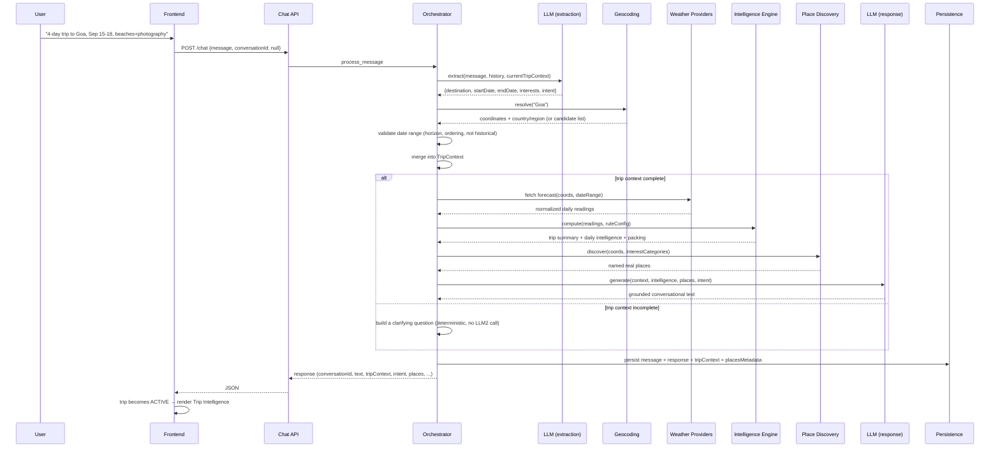
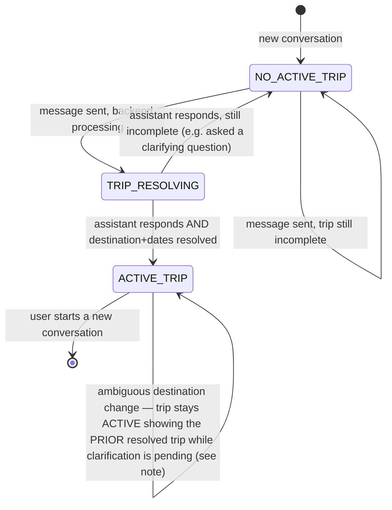

# Weather Intelligence — Rebuild Architecture Specification

**Status:** Standalone product/system specification for an independent rebuild.
**Audience:** A developer rebuilding this application from scratch, in their own stack, without access to the current codebase.
**Scope:** Product behavior, system architecture, data flow, contracts, and constraints. Implementation-agnostic — no framework, language, folder structure, class name, or UI toolkit is prescribed unless it represents an essential domain concept.

**How to read this document.** Every claim is labeled one of:

- **VERIFIED CURRENT BEHAVIOR** — observed running the current system and/or documented in `docs/WEATHER_INTELLIGENCE_FULL_E2E_AUDIT.md`.
- **DESIRED PRODUCT BEHAVIOR** — how the system should behave, whether or not the current build does this correctly.
- **CURRENT LIMITATION** — a known gap or external constraint in the current build.
- **REBUILD REQUIREMENT** — something the rebuild must do differently or must not regress.

Where the current implementation is wrong, this document says so and states the correct target behavior — it does not silently copy the bug forward.

---

## 1. Executive Summary

Weather Intelligence is a conversational travel-decision-support application. A user describes a trip in natural language; the system resolves the destination, validates the dates, retrieves real weather forecasts, runs a deterministic rule engine over them to produce trip-level and day-level travel intelligence, retrieves real nearby places from an open geographic data source, and uses an LLM only to explain — never to compute or invent — those results conversationally. The user can then ask follow-up questions, and the trip's structured intelligence must remain visible and correct across the whole conversation, updating only when the underlying trip actually changes.

The current implementation (audited 2026-09-15) is **substantially working**: real backend connectivity, real weather data, a correct deterministic intelligence engine, correct multi-turn LLM context retention, and correct persistence were all verified live. It has one confirmed HIGH-severity behavioral bug (an unresolved destination change destroys the trip workspace) and depends on an external place-data provider whose reliability is genuinely variable. Both are documented precisely in §30 so the rebuild does not reproduce them.

---

## 2. Product Vision

**Weather Intelligence transforms raw weather into travel decisions.**

It is not a weather app (which stops at reporting numbers), not a generic trip planner (which does not reason about weather), and not a general-purpose chatbot (which has no grounded backend truth to draw from). It is a decision-support system: weather is interpreted in the specific context of a specific trip, and the output is a judgment a traveler can act on.

```
RAW WEATHER  →  DETERMINISTIC INTELLIGENCE  →  GROUNDED CONVERSATIONAL EXPLANATION  →  TRAVEL DECISION
```

Example of the product's job: given `31°C, 18% rain probability` for a beach-and-photography trip, the product should be capable of saying *"September 15 is the strongest day for your beach and photography plans"* — a judgment, not a restatement of the number. The number must still be available (in structured form) for the user who wants it; the LLM's role is to add meaning on top of it, never to replace it or invent a different one.

---

## 3. Product Goals

1. Let a user plan a trip by describing it naturally, without filling out a form, while never losing information they've already given.
2. Ground every fact the user sees — a score, a day's rating, a place — in a deterministic computation or a real external data source. Never let generated text be the origin of a fact.
3. Make the trip's intelligence a persistent, glanceable companion to the conversation, not a one-off answer buried in a chat bubble.
4. Degrade honestly under external failure (a weather provider down, a place provider rate-limited) rather than fabricating a plausible-looking substitute.
5. Support the full natural lifecycle of trip planning: establishing a trip, asking about it from many angles, and revising it (dates, destination, interests, style, pace) without restarting the conversation.

---

## 4. Target Users / Use Cases

| User | Primary use case |
|---|---|
| Leisure traveler | "Is my trip a good idea, and which day should I prioritize?" |
| Family planner | "What if it rains — do we have an indoor fallback?" |
| Business traveler | Fixed dates; wants one complete, self-sufficient answer, not a back-and-forth |
| Repeat/comparison planner | Wants to compare a few different trips across separate conversations, and reopen any of them later without re-typing |
| Detail-oriented traveler | Wants the full day-by-day breakdown, not just a headline verdict |

---

## 5. Core User Experience

The primary interaction is a single conversational surface. A representative session:

```
User: I'm planning a 4-day trip to Goa from September 15 to September 18.
      I love beaches and photography.

System: [resolves destination, validates dates, retrieves weather,
         computes intelligence, retrieves places, responds concisely]
         → Trip Intelligence becomes visible: outlook, best day,
           watch-out day, day-by-day strip, real places, packing.

User: Which day is best?
System: [uses the already-established trip; no re-asking; concise,
         decision-first answer] → Trip Intelligence remains visible,
         unchanged unless the underlying data changed.

User: What if it rains?
System: [same trip context; weather-conditional answer]

User: What places can I visit?
System: [same trip context; names real places]

User: What should I pack?
System: [same trip context; weather-derived packing]

User: Keep it relaxed, I'm travelling with my parents.
System: [updates pace + travel style; trip stays the same trip]

User: Actually, change the dates to September 22–25.
System: [trip intelligence recomputes for the new dates]

User: Let's go to Bali instead.
System: [destination change; if ambiguous, asks which Bali — WITHOUT
         discarding the still-valid parts of the existing trip state
         the way the current build does; see §30, Problem 1]
```

**VERIFIED CURRENT BEHAVIOR:** every step above except the final one was demonstrated live in the audit, including correct extraction of "relaxed"/"parents" into pace/travel-style fields and correct date-change recomputation.

---

## 6. Functional Capabilities

The system must support, at minimum:

1. Natural-language trip initiation (destination + dates + optional interests/style/pace, in any order, in one message or spread across several).
2. Destination resolution to coordinates, including disambiguation when a name is not unique.
3. Date validation (a rejected or invalid range must produce a clear conversational explanation, not a silent failure).
4. Deterministic weather-intelligence computation per day and per trip (suitability score, risk level, confidence, best/watch-out day, per-day activity suitability, packing).
5. Real place discovery for the trip's destination and interests.
6. Grounded conversational response generation that explains — never invents — the above.
7. Context retention across turns: destination, dates, interests, travel style, and pace all survive until the user changes them.
8. Follow-up question handling without recomputation of unrelated subsystems (a packing question should not re-run place discovery, etc. — see §9C for exactly which capabilities each intent needs).
9. Conversation persistence: a conversation and its trip context must survive a browser refresh and be resumable later.
10. A rolling, recent conversation history in the UI, without implying older conversations are deleted.
11. A secondary, non-conversational "manual" path (pick a destination and dates directly) for users who prefer it or whose destination the conversation resolved incorrectly.

---

## 7. System Architecture

The system is a small number of conceptual layers, each with one responsibility. Names below are domain concepts, not mandated class names.

```mermaid
flowchart TB
    U[User / Browser] --> FE[Frontend Application]
    FE --> BFF[API Boundary\n(injects provider credentials server-side)]
    BFF --> API[Conversation / Chat API]
    API --> ORCH[Conversation Orchestrator]
    ORCH --> LLM[LLM Understanding Layer]
    ORCH --> CTX[Trip Context Manager]
    ORCH --> GEO[Geocoding]
    ORCH --> WX[Weather Provider Abstraction]
    WX --> NORM[Weather Normalization]
    NORM --> INTEL[Deterministic Weather Intelligence Engine]
    ORCH --> PLACES[Place Discovery]
    INTEL --> PACK[Packing / Recommendation Intelligence]
    ORCH --> RESP[Response Generation]
    RESP --> LLM
    ORCH --> PERSIST[Persistence]
    ORCH --> CACHE[Caching]
    GEO --> EXT1[(External Geocoder)]
    WX --> EXT2[(External Weather Providers)]
    PLACES --> EXT3[(External Place Data Provider)]
    LLM --> EXT4[(External LLM Provider)]
```

| Layer | Responsibility | Input | Output | Must NOT do |
|---|---|---|---|---|
| Frontend | Render conversation + trip intelligence; collect input | User actions | API calls | Compute intelligence, invent facts, parse facts out of generated prose |
| API boundary | Inject provider credentials server-side; never expose them to the browser | Browser request | Backend request | Ship any secret to client code |
| Conversation orchestrator | Sequence every turn: extract → validate → fetch only what's needed → generate → persist | User message + prior state | Structured response | Do its own weather/intelligence math; call subsystems the intent doesn't need |
| LLM understanding layer | Extract structured trip facts and intent from natural language; later, generate grounded conversational text | Message + history + current trip context | Structured JSON (extraction) / plain text (generation) | Be the source of truth for any number, score, or place; invent a fact absent from what it was given |
| Trip context manager | Hold and merge what is known about the trip across turns | Extracted fields | Updated trip context | Erase a field just because a turn didn't mention it |
| Geocoding | Resolve a destination name to coordinates + metadata | Place name | Resolved place, or a candidate list if ambiguous | Silently pick a wrong candidate; block the whole trip state on an unresolved lookup |
| Weather provider abstraction | Fetch raw forecast data from one or more providers, with fallback | Coordinates + date range | Raw provider response | Fabricate data when every provider fails |
| Weather normalization | Convert provider-specific shapes into one internal model | Raw provider response | Normalized daily readings | Silently fill in a field the provider didn't supply |
| Deterministic weather intelligence engine | Compute risk, suitability, confidence, best/watch-out days, packing from normalized weather | Normalized readings + rule config | Day-level + trip-level intelligence | Depend on the LLM for any part of its computation; be non-deterministic given the same inputs and config |
| Place discovery | Retrieve real nearby places matching trip interests | Coordinates + interest categories | Named, typed places | Invent a place; return an unnamed feature as if it were a real point of interest |
| Packing / recommendation intelligence | Derive a packing list from triggered weather conditions | Day-level risk factors | Deduplicated packing list | Generate unrelated travel content |
| Response generation | Turn grounded structured data into natural conversational text | Trip context + intelligence + places + intent | Final user-facing text | Introduce a fact not present in what it was handed |
| Persistence | Store conversations, messages, trip context, and per-turn structured metadata | Orchestrator writes | Durable state | Lose data on a normal turn; require special handling to survive refresh |
| Caching | Avoid redundant external calls for identical inputs | Provider/intelligence requests | Cached or fresh response | Serve stale data without a way to detect it's stale |
| Observability/error handling | Make failures visible and classifiable | Exceptions, provider responses | Logs, degraded-but-honest responses | Swallow the reason for a failure; report an unverified provider as "healthy" |

---

## 8. End-to-End Data Flow

### 8.1 First trip-establishing message



### 8.2 Follow-up turn

```mermaid
sequenceDiagram
    participant U as User
    participant ORCH as Orchestrator
    participant LLM as LLM (extraction)
    participant CAP as Only-needed capabilities

    U->>ORCH: "What if it rains?"
    ORCH->>ORCH: load existing conversation + TripContext
    ORCH->>LLM: extract(message, history, currentTripContext)
    LLM-->>ORCH: {intent: "weather_question"} (no dest/date change)
    ORCH->>ORCH: merge (no-op on unmentioned fields)
    ORCH->>CAP: fetch only what this intent needs (weather + places; no re-geocoding)
    ORCH->>ORCH: generate grounded response
    ORCH->>ORCH: persist
```

**REBUILD REQUIREMENT:** a follow-up must never re-run geocoding, and must never recompute intelligence unless the destination or date range actually changed. **VERIFIED CURRENT BEHAVIOR:** the audited system does not re-geocode on follow-ups (confirmed: zero geocoding calls on a recommendation follow-up in the same conversation).

---

## 9. Conversation Architecture

### 9A. Structured extraction (LLM)

Every user message is passed, together with recent conversation history and the trip context accumulated so far, to the LLM with instructions to return **only** a JSON object containing whichever of the following fields the message actually adds or changes:

| Field | Meaning |
|---|---|
| `destination` | Raw place name — only if this message introduces a **new or changed** destination |
| `searchArea` | A place within/near the established destination the user is asking about *for this turn only* (e.g., "more places near Kochi") — mutually exclusive with `destination` |
| `startDate` / `endDate` | ISO calendar dates, only if explicit or unambiguous |
| `duration` | Integer day count, only if a length is stated and both dates are not already given |
| `interests` | Short interest words actually mentioned |
| `travelStyle` | Who is traveling (solo/couple/family/friends/business), inferred from context |
| `pace` | Free-text pace preference (relaxed/packed/moderate) |
| `intent` | Exactly one value from the closed intent set (§9C) |

**Rules the extraction must enforce (DESIRED PRODUCT BEHAVIOR, VERIFIED as implemented):**

- Never invent a date, destination, or fact absent from the message or its direct implication.
- A field the message doesn't mention is **omitted from the JSON entirely** — never defaulted, never set to null-as-clear. Downstream merge treats "omitted" as "unchanged."
- A year-less date ("September 10") must be resolved against the current date supplied in the prompt: same year unless that date has already passed, in which case the next year. This requires the extraction prompt to be told the current date explicitly — the LLM has no reliable notion of "today" on its own.
- `destination` and `searchArea` never both appear in the same turn's output.

### 9B. Trip context merge semantics

See §10 for the full model. The essential rule: **a field's absence in an extraction result must never erase a previously known value.** This is the difference between a form (which has one submission) and a conversation (which accumulates). The only fields that should ever be actively *cleared* rather than merely left alone are:

- Dates, when a newly-stated range fails validation (so the next turn doesn't misread a rejected range as still-current).
- The resolved destination, when a fresh mention of a destination name turns out to be ambiguous (see §11's edge case and §30 Problem 1 for why this must not destroy the rest of the trip state).

### 9C. Intent understanding and capability selection

**VERIFIED CURRENT BEHAVIOR — the intent set actually implemented and exercised:**

| Intent | Triggers | Capabilities it should invoke |
|---|---|---|
| `trip_planning` | Establishing or substantially restating a trip | Weather + intelligence + places (if context complete) |
| `itinerary_request` | Day-by-day plan requests | Weather + intelligence + places |
| `weather_question` | "What if it rains?", conditional/weather-specific questions | Weather + intelligence + places (a weather-conditional question is very often also a places question — "what if it rains" implies "what should I do instead") |
| `recommendation_request` | Place/activity discovery | Weather + intelligence + places |
| `packing_request` | What to bring | Weather + intelligence only — **not** places (packing needs no place data) |
| `general_chat` | Anything else | No fetches; conversational only |

**CURRENT LIMITATION (documented in the audit as Issue-5):** semantically place-focused questions ("Which day is best?", "What places can I visit?") are sometimes classified as `itinerary_request` rather than `weather_question`/`recommendation_request`. In the current implementation this happens not to skip places (itinerary_request also fetches places), but it does mean the intent label itself is not a reliable signal of what the user actually asked, which risks future capability-selection bugs if a new intent-specific branch is added without accounting for this drift. **REBUILD REQUIREMENT:** intent classification for place-focused and day-specific questions must be reliable enough that capability selection can safely branch on intent alone, without over-fetching as a safety net.

### 9D. Response generation

A second, separate LLM call generates the user-facing text, given: recent conversation history, the current trip context, the intent, the deterministic weather intelligence (if fetched), the real places (if fetched), and nothing else. It must:

- Lead with the answer, not a restatement of the question.
- Stay concise — a hard sentence/paragraph cap, not "as long as feels natural." **VERIFIED CURRENT BEHAVIOR:** live responses ranged 83–433 characters across ten scenario turns; this is the target range, not a coincidence — it required an explicit prompt instruction with a hard limit and a banned-openings list ("Hey", "Great question", "Let me...").
- Never restate the full trip summary, full packing list, or full day-by-day breakdown unless the user specifically asked for it — that data is already visible in the structured UI, and repeating it is noise.
- Name at most a small number of places per answer, and only ones present in the structured data it was given.
- Adapt its shape to the intent: a day question leads with the day; a packing question is a compact list; a places question names the places; a weather question states the day and condition first.
- Never fabricate a value it wasn't given. If no places were retrieved, say so honestly in one sentence rather than answering with nothing (a bare "None." is a defect, not an acceptable minimal answer).

### 9E. Ambiguity handling

If the extracted intent, destination, or dates are ambiguous or contradictory, the system must ask a clarifying question rather than guess. The clarifying question is a **deterministic, template-generated** message (no LLM response-generation call needed) when the ambiguity is structural (e.g., "which of these 5 places did you mean") — the LLM extraction call has already run and identified the ambiguity; a second, more expensive generation call adds nothing here.

---

## 10. TripContext Model

The TripContext is the accumulated understanding of one trip, built up across every turn of one conversation.

| Field | Meaning | Required for intelligence? | Persists? | On omission in a turn |
|---|---|---|---|---|
| `destination` | Resolved place (coordinates + name + country + region + timezone) | Yes | Yes | Unchanged |
| `destinationQuery` | The raw text the user used for the destination, kept even after resolution | No | Yes | Unchanged |
| `startDate` | Trip start (validated calendar date) | Yes | Yes | Unchanged |
| `endDate` | Trip end (validated calendar date) | Yes | Yes | Unchanged |
| `interests` | Accumulated, deduplicated list of stated interests | No (enrichment) | Yes | Unchanged — and new interests **add to**, not replace, prior ones |
| `travelStyle` | Who is traveling (solo/family/couple/friends/business) | No (enrichment) | Yes | Unchanged |
| `pace` | Free-text pace preference | No (enrichment) | Yes | Unchanged |

**A trip is "complete" — i.e., intelligence can be computed — exactly when `destination`, `startDate`, and `endDate` are all known.** Everything else is enrichment that shapes the response and place matching but does not gate whether intelligence exists.

**Merge semantics (REBUILD REQUIREMENT, matching VERIFIED CURRENT BEHAVIOR):**

- A field is **immutable-by-default per turn**: a new value replaces the old one; the absence of a new value leaves the old one untouched. This must hold structurally (e.g., via an immutable/copy-on-write model), not just by convention, so a later turn can never accidentally mutate state an earlier turn observed.
- `interests` is the one field that **accumulates** rather than replaces: "I like beaches" then later "and museums" should result in both being known, not the second erasing the first. Deduplicate case-insensitively, preserving first-seen order.
- Date validation (ordering, forecast horizon, not-purely-historical) is a single deterministic rule, applied identically regardless of whether the date came from the LLM extraction or any other source. An LLM-proposed date is **never trusted directly into intelligence computation** without passing through this same validation.
- Destination resolution is likewise never trusted directly: the LLM extracts raw text; a deterministic geocoding step resolves it, and only the resolved, validated result enters the trip context.

---

## 11. LLM Architecture

**Principle (REBUILD REQUIREMENT):** the LLM is a natural-language *interpreter* over backend-computed and backend-retrieved facts. It is never the source of truth for a number, a score, a risk level, a confidence value, or the existence of a place. Every fact-bearing value the user sees traces to a deterministic computation or a real external data source; the LLM's only job is understanding input and explaining output in natural language.

**Two, and only two, LLM calls per conversational turn** (VERIFIED CURRENT BEHAVIOR):

1. **Extraction** — structured-output call (JSON mode where the provider supports it). Input: current message + recent history + current trip context. Output: the field set in §9A.
2. **Response generation** — free-text call. Input: trip context + intent + deterministic intelligence + real places. Output: the user-facing message. Only made when there is something to say beyond a deterministic clarifying question (§9E).

There is no agent loop, no autonomous tool-calling framework, and no chained/recursive LLM invocation within a turn. This bound (exactly two calls, both single-shot) is a deliberate architectural constraint, not an accidental simplification — it keeps latency, cost, and failure modes predictable.

**Structured output reliability:** request the provider's structured/JSON output mode where available. Even with structured output enabled, treat the result as untrusted input requiring validation (correct types, known enum values, dates that pass the date-range rule) before it enters the trip context — a model can return syntactically valid JSON with semantically wrong content.

**Reference resolution:** the extraction call must be able to resolve "it", "there", "the second day", and similar references using the supplied conversation history — this is why recent history (not just the current message) is part of the extraction input.

**Failure handling (DESIRED PRODUCT BEHAVIOR):**

- If the extraction call fails outright (network/timeout/malformed response), fall back to a deterministic minimal extraction (e.g., simple regex-based date/keyword detection) rather than blocking the turn — but never blend a fallback result with a partial LLM result; pick one path per turn.
- If the response-generation call fails or returns empty/malformed content, fall back to a deterministic templated summary built from the same structured data already computed — the user still gets a useful, factually correct answer, just not LLM-narrated. A response-generation failure must **never** surface as an HTTP error to the user; it degrades to the template.
- A reasoning-capable model may return separate "reasoning" and "content" fields, or may exhaust its token budget on internal reasoning before producing visible content (`finish_reason` indicating truncation/length). The integration must read only the actual content field, must treat a truncated/empty content as a failure (triggering the fallback above), and must never surface raw reasoning trace to the user.

**Desired response qualities (§9D expands on these):** concise, professional, context-aware, grounded, decision-first, not essay-like, complementary to (not duplicative of) the structured UI.

**Prompt inputs must include an explicit "today's date"** for relative/year-less date resolution — this is not optional; without it, year-less dates cannot be resolved correctly and will be silently dropped by a well-behaved model (which is the correct failure mode — silently *guessing* a year would be worse).

**CURRENT LIMITATION:** the LLM provider currently in use is not itself the dominant source of conversational latency (VERIFIED: a trivial call completed in ~0.5s). Latency in the current system is dominated by the place-discovery external call (§16/§30). The rebuild should not assume the LLM is the bottleneck and should design timeout/latency budgets around whichever external call is actually slowest for the chosen provider stack.

---

## 12. Geocoding

Destination resolution converts free-text ("Goa", "Kerala", "Paris") into coordinates plus enough metadata (country, region/admin area) to disambiguate same-named places, and a display name suitable for conversational use.

**Required behavior:**

- A single unambiguous match resolves silently.
- Multiple genuinely distinct matches (different countries, or meaningfully different regions) must produce a candidate list, not a silent best-guess. **VERIFIED CURRENT BEHAVIOR:** "Paris" correctly surfaces France vs. multiple US matches; the user is asked which one, by number.
- A curated alias/override layer for known-problematic lookups (place names the underlying geocoder resolves incorrectly or ambiguously in practice) is a reasonable pragmatic addition, but should be small and explicitly documented as a workaround for specific verified gaps — not a general substitute for the geocoder.
- Destination changes mid-conversation must go through the same resolution path as an initial destination, including ambiguity handling.

**Critical edge case (REBUILD REQUIREMENT, currently violated — see §30 Problem 1):**

> If a destination change mid-conversation turns out to be ambiguous, the system must ask for clarification **without discarding the rest of the established trip state**, and the frontend must not treat "destination currently unresolved" as "no active trip." The previous trip's intelligence should remain visible (clearly indicated as being in the process of updating, or simply unchanged) until the new destination resolves — it must not simply vanish.

This is a product requirement, not an implementation prescription: how exactly "unresolved-but-was-established" is represented (a status flag, a separate pending-destination field, whatever fits the rebuild's architecture) is an open decision for the rebuild. What must not happen is the observed current behavior: the entire structured workspace disappearing while the conversation history remains, because the frontend's "is there an active trip" check depends solely on "is destination currently resolved."

---

## 13. Weather Provider Architecture

**REBUILD REQUIREMENT:** the system must be built against a provider **abstraction**, not coupled to one specific vendor. A provider is anything that, given coordinates and a date range, returns a forecast.

**VERIFIED CURRENT BEHAVIOR (from the current build, as a reference point, not a mandate):** the current system configures four providers — Open-Meteo, OpenWeather, WeatherAPI, and Meteostat (historical-only) — with a priority order for forecast requests (Open-Meteo first, then OpenWeather, then WeatherAPI) and a separate priority for historical requests.

For each configured provider the rebuild must define:

- **Configuration & authentication** — how credentials are supplied, always server-side.
- **Normalization** — mapping the provider's own response shape into one internal reading model (§14). Every provider integrated must be normalized to the same shape so the intelligence engine is provider-agnostic.
- **Selection/fallback** — if the primary provider fails or times out, fall through to the next configured provider, in order, before failing the whole request.
- **Retry** — a small number of retries for transient failures (timeouts, 5xx) only; a 4xx or similar client error should not be retried.
- **Timeout** — a bounded per-provider timeout so one slow provider cannot indefinitely stall a turn.
- **Caching** — identical (coordinates, date-range) requests within a reasonable TTL should be served from cache rather than re-fetched, especially since a chat conversation can re-request the same trip's weather repeatedly across follow-up turns.
- **Degraded mode** — if every configured provider fails, the system must say so honestly (a clear, scoped failure) rather than returning fabricated or stale-and-unlabeled data.

**CRITICAL DISTINCTION the rebuild must preserve (this was the audit's central finding about the current health-reporting surface):**

> **"Provider is configured" is not the same claim as "provider has been verified reachable."** A provider-health surface that reports a provider as available purely because it has never recorded a failure is misleading — it conflates "no evidence of failure" with "verified working." **CURRENT LIMITATION (VERIFIED):** in the audited build, three of four configured weather providers had never actually been called in the observed session, yet all four reported `available` with the same stale timestamp. **REBUILD REQUIREMENT:** a health/status surface must distinguish "verified reachable as of a recent active check" from "no recorded failure, but unprobed" — these are different claims and must not share one status value.

Similarly: **CURRENT LIMITATION (VERIFIED)** — in the audited build, only the primary provider (Open-Meteo) has actually been exercised end-to-end in live testing; the fallback providers are configured and presumed functional but have not been live-verified to actually serve a request when the primary fails. The rebuild should not present an untested fallback chain as proven reliable, and should include a live smoke test that actually forces the fallback path.

---

## 14. Weather Data Model

The normalized daily reading — the one shape every provider's response must be converted into before reaching the intelligence engine — must carry, per day:

| Field | Nullable? | Notes |
|---|---|---|
| Date | No | Calendar date |
| Condition | No | Normalized condition category (clear/cloudy/rain/storm/etc. — an open, extensible set) |
| Temperature min/max | No | |
| Precipitation probability | No | 0.0–1.0 |
| Precipitation amount (mm) | **Yes** | Not every provider supplies this |
| Wind speed | No | |
| Humidity | **Yes** | Not every provider supplies this |

**REBUILD REQUIREMENT — this is a hard rule, not a style preference:** a field a provider genuinely does not supply must be represented as null/absent, and the intelligence engine and UI must both handle that absence explicitly (e.g., render "—", or simply omit a derived signal that depends on it). **Never substitute a fabricated default (such as 0) for a genuinely missing meteorological value** — a missing humidity reading is not the same fact as 0% humidity, and treating them the same would silently corrupt any computation or explanation built on top of it.

---

## 15. Deterministic Weather Intelligence Engine

This is the product's computational core and must remain independently testable, deterministic, and free of any LLM dependency.

```
normalized daily readings
   + rule configuration (versioned)
        ↓
   per-day risk factor evaluation (heat / cold / rain / wind / storm,
   each with a moderate and high threshold)
        ↓
   per-day activity suitability scores (one score per activity category,
   computed from a base score plus/minus configured penalties and bonuses
   per triggered risk factor — doubled when that factor's worst severity
   for the day is "high" rather than "moderate")
        ↓
   per-day advisory (proceed / caution / avoid, derived from the day's
   overall risk level) and per-day packing contribution (each triggered
   risk factor contributes specific items)
        ↓
   trip-level aggregation:
     - overall suitability score = mean of each day's mean activity score
     - overall risk = the worst single day's risk level
     - best day = lowest risk, then highest mean activity score, then
       earliest date
     - watch-out day = the opposite ordering
     - overall packing list = deduplicated union of every day's items,
       in a stable configured display order
     - confidence = weighted combination of forecast-horizon distance,
       provider agreement, and data completeness
```

**VERIFIED CURRENT BEHAVIOR (exact values traced live for a real Lisbon trip):**

```
score: 70 | risk: moderate | confidence: 0.5475
best: [2026-09-22] | worst: [2026-09-25]
packing: [light cottons, sunscreen]
  09-22 clear   proceed  low       {outdoor:80, beach:70, museum:60}
  09-25 clear   caution  moderate  {outdoor:65, beach:80, museum:65}
```

These values matched the rendered UI exactly, confirming no drift between backend computation and frontend display.

**REBUILD REQUIREMENTS:**

- Every threshold, weight, base score, penalty, bonus, and packing rule must live in **versioned configuration**, not hardcoded in the computation logic. Changing a number changes product behavior without a code change; the version identifier must be attached to any computed result so a future rule change doesn't silently reinterpret old data.
- Given identical inputs and identical rule configuration, the engine must produce identical output — no randomness, no hidden state, no LLM involvement.
- Confidence must honestly reflect the situation: a forecast far in the horizon, disagreement between providers (when multiple genuinely responded), or incomplete data must all lower confidence rather than being ignored. **CURRENT LIMITATION:** with effectively one provider actually serving requests in practice, the "provider agreement" term of the confidence calculation is systematically neutral/capped rather than reflecting genuine multi-provider agreement — this is an honest reflection of the current single-provider-in-practice reality, not a bug, but the rebuild should be aware that confidence will only become more meaningful once multiple providers are genuinely exercised.
- Missing weather data must lower confidence or otherwise be visible in the output, never be silently treated as if it were a favorable/neutral reading.

---

## 16. Best Day / Watch-out Day / Daily Intelligence

- **Best day** — the day the deterministic ranking (§15) identifies as most favorable across the trip.
- **Watch-out day** — the day it identifies as least favorable. On a single-day trip, the same day is necessarily both; the UI should present this as one unified statement, not two contradictory cards.
- **Daily intelligence** — the full per-day record (condition, temperature range, precipitation, risk factors, advisory, per-activity suitability, packing contribution) for **every day in the trip's actual date range.**

**REBUILD REQUIREMENT, explicitly called out because it is easy to get wrong:** the number of daily intelligence entries must always equal the trip's actual day count. A 3-day trip produces exactly 3 entries; a 7-day trip produces exactly 7. There must be no fixed assumption (e.g., a hardcoded 4-day layout) anywhere in the pipeline or the UI. **VERIFIED CURRENT BEHAVIOR:** a 4-day trip produced 4 daily-intelligence entries and a 4-tab day strip in the audited system; this correspondence must be preserved for any trip length up to the supported forecast horizon.

---

## 17. Place Discovery

**Purpose:** ground any place the assistant mentions in a real, named, geographically real point of interest — never a generated name.

**VERIFIED CURRENT BEHAVIOR — conceptual pipeline (the current system uses OpenStreetMap via the Overpass query interface; the rebuild is not required to use the same data source, but must satisfy the same behavioral contract):**

```
trip coordinates + interest categories
   → map interests to place-category tags (e.g., "beaches" → beach features,
     "museums" → museum features, "food" → restaurants)
   → construct a bounded spatial query (a search radius around the
     destination's coordinates)
   → issue the query to the external place-data provider
   → parse the response into candidate places
   → drop any candidate with no usable name — an unnamed geographic
     feature must never be presented as a named point of interest
   → normalize into (name, category/type, coordinates, address if
     available, a short deterministic reason derived from the day's
     actual weather suitability — never a generated reason)
   → persist the set actually used for this turn's response, associated
     with the conversation, so it survives refresh and thread restore
   → expose to the frontend as a structured field, separate from the
     conversational text
```

**Hard rules (REBUILD REQUIREMENT):**

- The LLM must never invent a place. Every place the assistant's text names must correspond to an entry in the structured places data it was given for that turn.
- The frontend must never parse place names out of the assistant's free text. It must render only from the structured places field.
- An unnamed geographic feature returned by the data source is correctly excluded, not a bug to "fix" by inventing a name for it.

**CURRENT LIMITATIONS, all external or data-inherent, VERIFIED live during the audit and important for the rebuild to anticipate rather than be surprised by:**

- The public Overpass instance the current system talks to intermittently returns `429 Too Many Requests` and `504 Gateway Timeout` under load. **The same query with identical inputs was observed to succeed in one run and fail minutes later** — this is genuine external non-determinism, not a coordinate or query defect.
- OSM data density and tagging varies enormously by region. A live probe found exactly one raw beach-tagged element near Goa's coordinates, and it carried no name tag — so zero named beach places is the **correct** output there, not a retrieval failure. The same destination returned 34–40 real named places under broader category tags.
- Different Overpass mirror/instance hosts have independently variable availability; a secondary "mirror" host added as a fallback in the current build was measured to be effectively unreachable (40+ second timeout) while the primary responded in ~1 second — meaning the fallback, as currently configured, adds latency without adding reliability. **REBUILD REQUIREMENT:** do not add a fallback host without first verifying it is actually reachable and actually faster to fail over to than simply retrying or timing out the primary. Prefer a small number of independently-verified-healthy endpoints, checked periodically, over a static hardcoded list.
- **CURRENT LIMITATION (Issue-5 from the audit):** place-focused questions are sometimes classified under an intent that happens to still fetch places in the current build, but this is fragile — the rebuild's intent classification must reliably route place-focused questions to place retrieval, not rely on a broader intent's fetch list as an accidental safety net.

---

## 18. Place Reliability / Fallback

Separate and handle distinctly:

| Failure mode | Correct behavior |
|---|---|
| No places found (query succeeded, zero real named results) | Honest, non-alarming: the response says so in one sentence; the UI shows an empty-but-present state, not an error, not an invented substitute |
| External provider timeout | Treated as "unavailable this turn" — the rest of the response (weather, intelligence) proceeds; places are simply absent from this turn |
| External provider rate limit | Same as timeout — a transient, retryable condition, not a hard failure to surface to the user as broken |
| Malformed provider response | Logged with enough detail to diagnose (see §27 — this was a real observability gap in the current build); treated the same as unavailable from the user's perspective |
| Insufficient underlying data (sparse/unnamed OSM features) | Not a failure at all — a correct "nothing here" result; must not be conflated with a provider failure in logs or in user-facing copy |

**REBUILD REQUIREMENT:** whichever of these occurred should be distinguishable in logs/observability, even though the user-facing behavior (graceful, honest, no fabrication) is similar across most of them.

---

## 19. Packing Intelligence

Packing is a **derivative of weather intelligence**, not a separate feature:

- Each day's triggered risk factors (rain, storm, heat, cold, wind) contribute specific packing items (e.g., rain → waterproof jacket; heat → sunscreen).
- The trip-level packing list is the deduplicated union of every day's contributions, rendered in a stable, configured order (not alphabetical, not insertion order — a deliberately chosen display order so the same conditions always produce the same-looking list).
- Packing must remain concise — a short list, not a generated packing guide or unrelated travel-content essay.
- A day/trip with no triggered risk factors correctly produces an empty or minimal packing list — "nothing special needed" is a valid, positive result, not a gap to fill with generic advice.

---

## 20. Persistence

**What must persist, durably, independent of any request lifecycle:**

- Conversations (an identity, creation/update timestamps, active/inactive state).
- Every message in a conversation (role, content, timestamp).
- The trip context as of the latest turn (all fields from §10).
- Per-turn structured metadata needed to reconstruct the UI without re-computing: at minimum, which intent was classified, whether the response was LLM-generated or a deterministic fallback, and **the real places used for that turn** (this must be persisted, not merely held in the live response — see below).
- Enough to distinguish "this turn genuinely retrieved zero places" from "this turn never attempted place retrieval," so a restored conversation can tell the difference.

**Critical requirement, stated because it was a genuine gap in an earlier iteration of the current build and matters for the rebuild:** if places, or any other per-turn structured fact the UI depends on, are computed inside a chat turn but only returned in the live HTTP response and never written to durable storage, then reopening that conversation later (browser refresh, revisiting from history) will show an empty state even though real data was once retrieved. **REBUILD REQUIREMENT:** anything the persistent trip-workspace UI needs to render must be persisted, not merely returned once.

**What is transient / request-scoped, and must NOT be persisted as if it were durable trip state:**
- The live external-provider response for a single request (weather fetch, place fetch) — these are re-fetchable and should be cached (§13), not treated as permanent trip state.
- Any UI-only derived value (a day-state label, a formatted string) — derive it from persisted structured data on render, don't persist the derived form.

**VERIFIED CURRENT BEHAVIOR:** a 20-message conversation was confirmed to fully restore — trip context (including `pace`/`travelStyle`), and 5 of its messages carrying persisted places metadata — after both a direct API fetch and a full browser reload.

**Conversation switching:** navigating between conversations must load a fresh, independent state for the newly-selected conversation and must not leak any state (draft input, places, intelligence) from the previously-viewed conversation into the newly-opened one.

---

## 21. Conversation History (UI presentation)

**DESIRED PRODUCT BEHAVIOR:** the conversation history surface shows a **rolling window of the current conversation plus the two most recent previous ones** — three total, newest first, with the currently-open conversation always included even if it would otherwise have aged out of the newest-three window.

```
Conversation A created           → rail shows: A
Conversation B created           → rail shows: B, A
Conversation C created           → rail shows: C, B, A
Conversation D created           → rail shows: D, C, B   (A no longer shown)
```

**This is a presentation window only.** It must not imply, and must not cause, deletion of older conversations from persistent storage — the backend retains every conversation unless the user takes an explicit, separate deletion action. If the user reopens an older conversation not currently in the rolling window, it must load correctly (full history, full trip context) and should then be treated as "currently active" for the purposes of the window (so it displays even though it isn't among the newest three by recency alone).

---

## 22. Frontend Product Experience

Independent of any specific framework, the frontend must express this conceptual layout:

```
┌───────────────┬─────────────────────────────┬──────────────────────────┐
│  LEFT          │  CENTER                      │  RIGHT                    │
│  Recent trips/ │  Active conversation          │  Active trip intelligence │
│  conversations │  (message stream + composer)  │  (persistent workspace)   │
│  (rolling 3)   │                               │                           │
└───────────────┴─────────────────────────────┴──────────────────────────┘
```

The exact visual design (colors, density, component choices) is explicitly **not** prescribed by this document — the reference screenshots in `/reference screenshots/` establish a visual direction (dark, professional, compact, conversation-first with a persistent secondary intelligence rail) but the rebuild is free to reinterpret this visually as long as the three-region information relationship and the behavioral rules in §23 are preserved.

The UI must communicate, using structured backend data only (never parsed from conversational prose):

- Current trip identity (destination, dates, stated interests/style/pace).
- The active conversation.
- Trip-level intelligence (outlook/suitability/confidence, best day, watch-out day).
- Day-by-day intelligence, sized to the actual trip length.
- Real places for the trip.
- Packing signal.
- A way to inspect the full trip context (what the system currently understands).
- Contextual follow-up suggestions/actions, derived from the current intent and available data — not a fixed set repeated identically on every turn.

**Responsive requirement:** the three-region layout must degrade sensibly on narrow viewports (the reference product collapses history and intelligence into reachable secondary surfaces — drawers, toggles, or an equivalent — rather than simply deleting them). At minimum, verified breakpoints to design and test against: ~390px (mobile), ~768px (tablet), ~1280px, ~1600px (desktop). **VERIFIED CURRENT BEHAVIOR:** the audited build renders without horizontal overflow and without console errors at all four widths, with the intelligence layer reachable (not removed) below the desktop breakpoint.

---

## 23. Active Trip Lifecycle

This is one of the most important behavioral contracts in the whole product and must be implemented precisely.



**Precise rules:**

1. **Before a trip is established:** the UI shows a clean conversational starting state. No trip-intelligence workspace, no outlook, no placeholder/loading skeleton pretending intelligence is coming — because it isn't computable yet.
2. **The user asks an initial trip-establishing question:** the backend attempts to resolve it. While this is in flight, the workspace still does not appear — it must not flash into existence and then get filled in; it appears once, complete, or not at all for this turn.
3. **The assistant responds successfully and the trip is now complete** (destination + dates resolved): the trip-intelligence workspace becomes visible, for the first time, attached to this response. **REBUILD REQUIREMENT, stated explicitly because it was a real defect found during the previous rebuild pass on the current system:** the workspace must gate on *both* "trip context is complete" *and* "the assistant has actually replied" — gating on trip-completeness alone causes the workspace to flash into existence mid-turn, beside a question that hasn't been answered yet.
4. **After the trip is established, it becomes part of the active-trip workspace** and must remain visible through every subsequent turn, regardless of that turn's intent. A packing question, a weather question, a places question, a general remark — none of them should cause the workspace to disappear. Only its *contents* update when the underlying trip data actually changes; its *presence* does not depend on the latest turn's topic.
5. **A context modification** (pace, travel style, interests) keees the same trip active; the workspace stays, and any parts of it derived from the changed field should reflect the update.
6. **A date or unambiguous-destination change** causes the trip's intelligence to be recomputed for the new parameters — this is a genuine recomputation (new weather fetch, new intelligence, likely new places), not a reset to "no trip." The workspace stays visible throughout, updating in place.
7. **An ambiguous destination change is the one case the current build gets wrong (§30 Problem 1) and the rebuild must get right:** the system must ask for clarification, and the *previously established* trip's workspace must remain the visible state (whether frozen, marked as "confirming new destination," or simply left as-is) until the new destination resolves or the user abandons the change. It must not collapse to "no active trip."
8. **A new conversation** starts a genuinely fresh state — no bleed-through from whatever trip was previously active in a different conversation.

---

## 24. Intelligence UI

Structured information the frontend is expected to expose, all sourced from structured backend fields, never from parsing assistant text:

- **Overall Trip Outlook** — suitability score, overall risk level, confidence (in plain language, not just a raw number).
- **Best Day** — date plus a brief, data-derived reason (e.g., its strongest activity category and score).
- **Watch-out Day** — date plus the most severe triggered risk factor's description, verbatim from the rule engine (not re-generated).
- **Your Days** — one entry per actual trip day (§16), each showing at minimum: date, condition, temperature, and a day-state indicator (best/good/caution/watch-out) derived from the same best/worst/advisory fields, not independently invented.
- **Day detail** — on selecting a day: full risk-factor list, activity suitability scores, and that day's packing contribution.
- **Places for your trip** — named, typed, with address where available and a weather-suitability cue; grouped/labeled by what interests they were matched against.
- **Packing Signal** — the deduplicated trip-level list, or an honest "nothing special needed."
- **Trip Context** — an inspectable view of everything currently known about the trip (§10's fields), for the user to verify what the system understands, without turning it into an editable form (the user updates it by saying so in conversation, not by filling in fields).

The exact visual treatment of each of these is open to the rebuild.

---

## 25. API Architecture

Use the **current OpenAPI specification as the authoritative source** for exact endpoint paths, methods, and schemas if reusing the current backend's contract; the table below documents the conceptual surface a rebuild must provide, regardless of exact naming.

| Capability | Purpose | Real-time / cached / persistent |
|---|---|---|
| Health/status | Liveness check | Real-time, unauthenticated |
| Provider status | Reports configured external providers and their last-known status | See §13's critical distinction — must not conflate "unprobed" with "verified healthy" |
| Create conversation | Start a conversation, optionally with an opening message | Persistent write |
| List conversations | Populate history | Reads persistent state; may be lightly cached client-side |
| Get conversation | Full message history + current trip context, for restore/resume | Persistent read |
| Send chat message | The primary interaction — one turn in, one turn out | Triggers the full pipeline (§8); persists on completion |
| Geocoding (if exposed as its own endpoint, vs. only used internally by chat) | Resolve a place name to coordinates | Real-time; results may be cached |
| Weather (raw) | Normalized daily readings for a resolved location + date range | Cacheable; not persisted long-term beyond the cache TTL |
| Intelligence | Full deterministic trip-level + daily intelligence for a resolved location + date range | Computed from cached/fresh weather; itself cacheable |
| Trip Summary Card equivalent (best-days, packing, etc.) | Whatever finer-grained projections of intelligence the frontend needs | Same source as the full intelligence computation — must never diverge from it |

**Ownership of computation:** every endpoint that returns a number, score, or level must be backed by the deterministic engine (§15), never by an LLM call. Endpoints that involve the LLM (chat) must clearly separate the LLM-authored text field from every structured field around it.

**Errors:** every endpoint must return a consistent, structured error shape (a machine-readable code plus a human-readable message), and validation failures (bad dates, malformed input) must be caught before reaching any external provider call.

---

## 26. ChatResponse Contract

**VERIFIED CURRENT BEHAVIOR — the actual current contract, to be used as the reference shape (confirmed byte-identical between the published OpenAPI spec and the live runtime schema):**

| Field | Required? | UI-facing? | Meaning |
|---|---|---|---|
| `conversationId` | Yes | Yes | Identity for this conversation; used to route subsequent turns and build the shareable URL |
| `response` | Yes | Yes | The assistant's text — rendered as-is, never parsed for facts |
| `contextComplete` | Yes | Yes (gates workspace visibility, see §23) | Whether destination+dates are both resolved |
| `missingEssentials` | Yes | Supporting | Which of destination/start/end are still unknown |
| `tripContext` | Yes | Yes | The full current trip context (§10) |
| `intent` | Yes | Internal/supporting | The classified intent for this turn — drives follow-up-suggestion logic; not shown verbatim to the user |
| `llmGenerated` | Yes | Supporting | Whether `response` came from the LLM or a deterministic fallback — lets the UI optionally disclose provenance |
| `places` | Optional (default empty) | Yes | Real places grounding this turn's response |
| `destinationCandidates` | Optional (default empty) | Supporting (drives clarification behavior, not necessarily a rendered picker — see §11's product decision to avoid a dedicated disambiguation UI) | Populated only when the response is a destination-disambiguation question |

**REBUILD REQUIREMENT:** whatever the rebuild's exact field names, this same information must be present and this same required/optional split must hold — in particular, `places` and `destinationCandidates` being legitimately absent on most turns (not every turn fetches them) must be represented as "field absent/empty," never conflated with an error.

---

## 27. Frontend Responsibilities

The frontend owns presentation and interaction; it must not own business logic. Concretely:

- **Must:** render exactly what structured fields say; derive purely presentational labels (e.g., "Best day" chip text) from structured fields (best/worst-day membership, advisory) without inventing new judgments.
- **Must:** treat `response` (and any per-message `content`) as opaque display text — never regex/parse it for a date, score, or place name, even if doing so would "work" most of the time.
- **Must:** gate the active-trip workspace on the precise rule in §23, not on a simpler proxy that happens to usually agree with it.
- **Must:** scope cached/derived state (e.g., "the places for the current trip") to the trip's actual identity (destination + dates), so a destination or date change cannot leak the previous trip's places into the new one.
- **Must not:** hardcode any destination name, place name, weather value, or score anywhere in the production render path. (Example strings in empty-state prompts or input placeholders are fine; they must contain no place names or invented facts.)
- **Must not:** swallow API errors silently — a failed fetch must produce a visible, scoped degraded state (see §26 for which failures get their own UI state vs. which are simply absent fields).

---

## 28. Error Handling

| Failure | Principle | Expected behavior |
|---|---|---|
| LLM extraction failure | Degrade, don't block | Deterministic fallback extraction; turn proceeds |
| LLM response-generation failure | Degrade, don't fail the request | Deterministic templated summary from already-computed structured data; HTTP 200, not an error |
| Weather provider failure (one) | Fall through | Try the next configured provider |
| Weather provider failure (all) | Honest failure | Clear, scoped error — never fabricated weather |
| Place provider failure/timeout/rate-limit | Degrade silently in the response, visibly in logs | Response proceeds without places; §18's table applies |
| Geocoding failure | Ask, don't guess | Clarifying question or explicit "couldn't find that place" |
| Invalid dates | Reject deterministically | Clear conversational explanation of what's wrong (too far out, reversed, purely historical) |
| Ambiguous destination | Ask, preserve prior state | See §12's critical edge case and §23 rule 7 |
| Missing trip information | Ask for exactly what's missing | Deterministic clarifying question, in the order destination → start date → end date |
| Backend/database failure | Fail loudly to logs, gracefully to the user | Never a raw stack trace or internal error string surfaced to the client |
| Network failure (client-side) | Scoped retry affordance | The specific failed turn is retryable; the rest of the conversation stays intact and readable |
| Timeout | Bounded, provider-specific | See §13, §30 — a single slow external dependency must not make the whole turn (or worse, the whole conversation) unusable |
| Rate limiting (inbound, on the API itself) | Explicit, honest | A clear rate-limited response, not a silent drop |

**General principle, stated once because it governs all of the above: DEGRADE GRACEFULLY, never SHOW FAKE DATA.** Every failure mode above has a defined honest behavior; none of them has a "make something plausible up" behavior.

---

## 29. Security

- API keys and credentials for every external provider (LLM, weather, geocoding, place data) must live server-side only and must never be present in any browser-delivered bundle or client-visible network request.
- If a browser-facing proxy/BFF layer is used, it — not the browser — attaches provider credentials to outbound requests.
- Backend API access must be controlled (an API key or equivalent) and distinguish, if an operator surface exists (e.g., provider health), operator-level access from ordinary consumer access.
- Logs must never contain secrets (API keys, credentials) even at debug verbosity.
- One user's conversation data must never be retrievable by or leaked into another user's session (this matters more once the system supports more than a single shared context — the current single-tenant-style build should not be taken as evidence this is unnecessary).
- All validation (dates, required fields, business rules) is enforced server-side; the frontend's own validation is a UX convenience only and must never be the sole enforcement point.
- The frontend must never be trusted to correctly compute or enforce a business rule (a date range limit, a required field) — only to reflect backend-enforced rules pleasantly.

---

## 30. Performance

**VERIFIED CURRENT BEHAVIOR — observed live latencies across a ten-turn conversation:**

| Turn type | Observed latency |
|---|---|
| A trivial LLM call alone | ~0.5s |
| A turn with no place fetch | 1.6–8.6s |
| A turn with a successful place fetch | 5.8–33.0s |
| A turn with a place-fetch failure (both configured hosts exhausted before falling back) | 73.3–81.3s |

**Critical finding, stated as a rebuild requirement:** the LLM provider is **not** the latency bottleneck. Place discovery — specifically, external provider instability plus an unreliable fallback host that itself takes ~40 seconds to fail — is the dominant source of slow turns, and in the worst observed case exceeded a reasonable client-side request budget.

**REBUILD REQUIREMENTS:**

1. Isolate place-discovery latency from the rest of the turn wherever architecturally reasonable — a slow or failing place provider should not make weather intelligence, the conversational response, or the rest of the turn slow or unavailable. Consider whether place discovery genuinely needs to block the response, or whether it could be decoupled (e.g., fetched independently, or with a tighter internal timeout than the overall request budget).
2. Any fallback/secondary provider host must be verified reachable and verified to actually reduce failure rate before being wired in — an unverified fallback can make the worst case *worse*, as demonstrated in the current build.
3. Cache aggressively where inputs are identical (same coordinates + date range for weather/intelligence within a conversation's follow-up turns) — a chat conversation naturally re-requests the same trip's data repeatedly.
4. Set per-external-call timeouts deliberately, with the overall end-to-end request budget in mind — the sum of every provider's worst-case timeout, plus retries, plus fallback attempts, must not exceed what a user will tolerate waiting for a single chat reply.
5. The LLM's own timeout/retry budget can be comparatively generous, since it is not the observed bottleneck — but should still be bounded, with the deterministic-fallback behavior from §11/§28 as the actual reliability mechanism.

---

## 31. Observability

- Every external-provider call outcome (success, which host, latency, and on failure — the **actual error**, not just a category label) must be logged in a way that is actually inspectable, not just present in a structured field that the log formatter silently drops. **CURRENT LIMITATION (VERIFIED):** in the audited build, a places failure logs only the bare string `"places_unavailable"`; the underlying exception detail was passed via a structured logging field that the configured log format does not render, making the actual cause invisible without re-instrumenting. **REBUILD REQUIREMENT:** the human-readable failure reason must appear directly in the log line under the logging configuration actually deployed, not only in a field that depends on a particular formatter to surface.
- Provider health/status reporting must distinguish verified-recently-reachable from never-probed (§13).
- Request-level tracing (a request ID present in both the response envelope and the logs) should be preserved so a specific user-reported issue can be correlated to its backend log lines.
- Logs must never contain secrets (§29).

---

## 32. Testing Strategy

| Layer | What to cover |
|---|---|
| **Unit** | Deterministic intelligence engine (every rule/threshold/score path); date validation; TripContext merge semantics (including the "omission never erases" rule and the "interests accumulate" exception); place parsing and the unnamed-element filter; provider response normalization; intent classification logic |
| **Integration** | Full API contract (request/response shapes, error codes) against a real or fully-faked HTTP layer; database persistence and restoration; the orchestrator's end-to-end turn logic with faked (not live) external calls |
| **End-to-end (mocked externals)** | Initial trip; multi-turn follow-up; date change; destination change (including the ambiguous case — this must have a dedicated test given §12/§23's critical requirement); packing question; place discovery; browser refresh; conversation switching |
| **Live smoke tests (real externals, run separately from the main suite, not gating every commit)** | A real call to the LLM provider; a real call to at least the primary weather provider, and ideally a forced-failure test that verifies the fallback provider actually serves a request; a real call to the place-data provider; a real geocoding lookup |

**REBUILD REQUIREMENT, directly motivated by the audit's central conclusion:** *every failure found in the audit of the current system lived in behavior that had zero live/integration/browser-level test coverage*, despite extensive unit-test coverage elsewhere. Unit test count is not a proxy for correctness of the full pipeline. The rebuild must include the live and end-to-end layers above as first-class, not optional — in particular, a test that exercises the exact ambiguous-destination-mid-trip scenario (§12/§23) would have caught the current system's most significant defect before it reached a live build.

---

## 33. User Flow Specifications

For each flow: **input → system interpretation → backend processing → data sources → response → frontend state → expected UX.**

**Flow 1 — New trip.** Input: a message naming destination + dates (+ optional interests/style/pace) → extraction identifies all fields + `trip_planning` intent → geocode, validate dates, fetch weather, compute intelligence, discover places → weather + geocoding + place providers → concise grounded response → frontend transitions `NO_ACTIVE_TRIP → ACTIVE_TRIP` (§23 rule 3) → full workspace appears once, complete.

**Flow 2 — Multi-turn follow-up.** Input: any follow-up not changing destination/dates → extraction returns only an intent (no dest/date fields) → context reused as-is, only the needed capabilities (§9C) invoked → response → workspace **unchanged in presence**, possibly unchanged in content too if nothing computable changed.

**Flow 3 — Best-day question.** Input: "Which day is best?" → `weather_question`/day-focused intent (see §9C's reliability requirement) → weather+intelligence (+ places, per §9C) reused from the established trip → response leads with the specific day and a one-clause reason → workspace unchanged.

**Flow 4 — Weather/rain question.** Input: "What if it rains?" → `weather_question` → weather+intelligence+places (a weather-conditional question implies wanting an alternative) → response gives a weather-aware alternative, concisely → workspace unchanged.

**Flow 5 — Place-discovery question.** Input: "What places can I visit?" → `recommendation_request` → places (+ weather/intelligence) → response names real places from the structured data → workspace's Places section reflects this turn's results (§21's "most recently retrieved for this trip" retention rule).

**Flow 6 — Packing question.** Input: "What should I pack?" → `packing_request` → weather+intelligence only, **no** place fetch → response gives a concise weather-derived list → workspace's Packing section is already showing the trip-level list (independent of the question being asked).

**Flow 7 — Day-specific question.** Input: "Tell me more about September 17" → reference resolved against conversation history + trip context → that day's full daily-intelligence record → response focused on that one day → if the UI has a day-selection affordance, selecting the referenced day should be reflected there too.

**Flow 8 — Pace/travel-style modification.** Input: "Keep it relaxed, I'm travelling with my parents." → extraction sets `pace: relaxed`, `travelStyle: family`, no destination/date fields → merge updates only those fields → response acknowledges and adapts tone/suggestions → workspace unchanged in presence; Trip Context section reflects the new fields.

**Flow 9 — Date modification.** Input: "Actually, change the dates to September 22–25." → extraction returns new `startDate`/`endDate` → validated → new weather fetch, intelligence recompute, place re-discovery for the new range → response reflects the change → workspace's outlook/days/places/packing all update in place; identity (destination) unchanged.

**Flow 10 — Destination modification (unambiguous).** Input: "Let's go to Kerala instead." → extraction returns new `destination` → geocode resolves unambiguously → full recompute (weather, intelligence, places) for the new destination, same dates unless also changed → workspace updates in place, including trip identity header.

**Flow 11 — Destination modification (ambiguous).** Input: "Let's go to Paris instead." → extraction returns new `destination` → geocoding returns multiple genuine candidates → deterministic clarifying question naming the candidates, **no LLM response-generation call needed** → **critical:** destination remains unresolved, but the workspace must not collapse (§12, §23 rule 7) → once the user picks one, resolution completes and the full recompute (as in Flow 10) proceeds.

**Flow 12 — Refresh/reopen existing conversation.** Input: browser refresh, or selecting a conversation from history → full conversation + trip context + persisted places fetched from storage → workspace reconstructed entirely from persisted structured data, no re-computation required unless the user asks something new → **VERIFIED CURRENT BEHAVIOR:** this works correctly in the audited build for an established trip.

**Flow 13 — New conversation/history.** Input: user starts a new conversation → fresh `NO_ACTIVE_TRIP` state, independent of any other conversation's state → history rail shows the rolling window per §21, with the new conversation now first.

**Flow 14 — Provider failure.** Input: any turn where an external provider (weather, place, LLM) fails → §28's table applies per provider type → the conversation remains usable; only the specific affected capability degrades; nothing is fabricated.

---

## 34. Non-Functional Requirements

- **Reliability:** a single external provider's failure must degrade one capability, never the whole conversation (§28, §30).
- **Performance:** see §30's explicit latency budget guidance; place-discovery latency must be isolated from the rest of the turn.
- **Observability:** see §31; failure reasons must be genuinely inspectable, not just structurally present.
- **Security:** see §29; no credentials client-side, ever.
- **Maintainability:** the deterministic intelligence engine's rules/thresholds/weights must be externalized to versioned configuration (§15), not hardcoded.
- **Testability:** the intelligence engine, date validation, and TripContext merge logic must be testable in complete isolation from any network dependency (§32).
- **Scalability:** conversation and message storage should not assume a single-user/single-tenant deployment indefinitely, even if the current build is effectively single-tenant in practice.
- **Graceful degradation:** the single governing principle of §28 — never fake data, always degrade honestly and visibly (in logs) / quietly-but-honestly (to the user, where appropriate).
- **Responsive frontend behavior:** no horizontal overflow, no removed-not-just-reflowed intelligence layer, at all verified breakpoints (§22).
- **Accessibility:** the conversation stream should be announced appropriately to assistive technology as new messages arrive (a live-region pattern); interactive elements (day selection, follow-up suggestions, history entries) must be keyboard-reachable and properly labeled; this was not the focus of the current audit but is a baseline expectation for a production conversational UI.

---

## 35. Rebuild Principles

1. Backend/domain logic is the source of truth for every fact.
2. Structured data drives structured UI; conversational text never does.
3. The LLM interprets; it never invents.
4. Weather becomes travel intelligence through a deterministic, versioned, testable rule engine — not through the LLM.
5. Real places remain grounded in a real external data source; unnamed/unreal features are correctly excluded, never papered over.
6. External provider failures must be visible in logs and gracefully, honestly handled in the product.
7. Conversation context persists durably and merges without silently erasing anything the user hasn't actually changed.
8. Active-trip state is explicitly distinct from unresolved/ambiguous state — the two must never be conflated (this is the rebuild's single most important behavioral fix relative to the current system).
9. The frontend never duplicates business logic and never parses facts out of generated text.
10. No fake data anywhere in the production path — ever, under any failure condition.
11. The architecture stays provider-agnostic wherever practical (weather, geocoding, place data, and even the LLM provider itself should be swappable behind their respective abstractions).
12. New UI design is fully permitted; the product behavior specified in this document is not.

---

## 36. What NOT to Prescribe

This document intentionally does not mandate:

- Any specific frontend framework, styling system, or component library.
- The current backend or frontend's folder structure, module boundaries, or class names.
- The current backend's specific programming language or web framework.
- The current exact visual design (the reference screenshots are a direction, not a pixel spec).
- The current Overpass mirror host, or any specific place-data provider — only the behavioral contract in §17/§18.
- Any other current implementation detail not called out above as a behavioral requirement.

---

## 37. Known Current-System Problems and Rebuild Requirements

Directly from `docs/WEATHER_INTELLIGENCE_FULL_E2E_AUDIT.md`, classified:

| # | Problem | Classification | Rebuild requirement |
|---|---|---|---|
| 1 | Ambiguous destination change destroys the active-trip workspace, conflating "unresolved" with "no trip." | **Application bug** | §12, §23 rule 7 — must not conflate these two states |
| 2 | A fallback Overpass mirror host is effectively unreachable and adds ~20–40s to failing turns rather than improving reliability. | **Application/configuration bug** (an unverified fallback was wired in) | §17, §30 — verify any fallback endpoint before relying on it |
| 3 | `/providers/health` reports unprobed providers as `available`, identically to genuinely-verified ones. | **Application bug / misleading observability** | §13, §31 — distinguish "unprobed" from "verified reachable" |
| 4 | Place-provider error detail is not visible in the deployed log format. | **Test/observability gap** | §31 — failure reasons must be genuinely inspectable |
| 5 | Some place-focused questions are classified under a broader intent, which happens not to skip place-fetching today but is a fragile coincidence. | **LLM/prompt problem, currently masked** | §9C — intent classification must be reliable enough to gate capability selection directly |
| 6 | Live-service, integration, and browser-level test coverage is thin relative to unit coverage; the bug in #1 had zero coverage at any of those levels. | **Test-coverage gap** | §32 — live/E2E layers are first-class, not optional |
| 7 | Overpass (or any chosen place provider) reliability is genuinely external and non-deterministic — identical queries succeed and fail minutes apart. | **External provider limitation** | §17, §18 — design for this explicitly, don't treat it as a solvable bug |
| 8 | Some destinations have sparse or unnamed place data at the OSM feature level for specific category tags (e.g., Goa's beaches). | **Expected data limitation** | §17 — zero real named results is a correct, not broken, outcome in this case |

---

## 38. Verified Current Capabilities

From the audit, confirmed working via live execution (not just code inspection) — these represent a working baseline the rebuild should meet or exceed, not problems to solve:

- Real frontend↔backend connectivity (verified via network-call tracing, not code reading).
- Real weather data reaching the UI (varied, non-static, correctly marked cache-status).
- Deterministic intelligence computation matching the UI exactly, value for value.
- Correct trip suitability, confidence, best/watch-out day computation.
- Daily intelligence sized correctly to actual trip length.
- Correct, weather-derived packing computation.
- Real place results where the external provider and underlying data permit (34–40 places for 4 of 5 tested destinations).
- Conversation persistence surviving refresh and reopening.
- Correct multi-turn context retention, including pace/travel-style/interest updates without re-asking.
- Correct date-change and unambiguous-destination-change recomputation.
- Correct multi-turn LLM understanding (10 live scenario turns, all extracted and classified sensibly).
- Byte-identical API contract between the published spec and the live runtime.
- Zero console errors and no layout overflow across four tested breakpoints.

**Explicitly not overstated (do not treat as proven beyond what was verified):** fallback weather-provider paths (configured but not live-forced-failure-tested); a multi-provider "agreement" confidence signal (only one provider genuinely exercised in practice); the place-provider fallback host (proven unreliable, not proven reliable).

---

## 39. Acceptance Criteria

The rebuilt system is acceptable when this full conceptual flow works, live, against real external providers:

```
"I'm planning a 4-day trip to Goa from September 15 to September 18.
 I love beaches and photography."
   → trip understood, destination resolved, dates validated,
     weather retrieved, intelligence computed, places retrieved,
     grounded response generated, trip persisted
   → conversation + trip intelligence both become visible

"Which day is best?"
   → existing context reused, concise answer, active trip intelligence preserved

"What if it rains?"
   → same trip context, weather-aware alternative, intelligence preserved

"What places can I visit?"
   → real places retrieved/reused, named in response and in the UI

"What should I pack?"
   → weather/trip-context-derived packing, concise

"Keep it relaxed because I'm travelling with my parents."
   → trip context updates (pace, travel style); same trip, same workspace

"Change the dates."
   → trip intelligence recomputes correctly for the new dates

"Actually, let's go to Bali instead."
   → destination change handled correctly, INCLUDING the case where the
     new name is ambiguous — the existing workspace is not destroyed
     merely because the new destination hasn't resolved yet
```

Every arrow above must be independently demonstrable against a live, running system — not merely covered by a unit test with faked externals.

---

## 40. Open Decisions / Future Enhancements

These are explicitly **not resolved** by this document and are left to the rebuild's judgment:

- Exact visual representation of "trip is confirming a new destination" while an ambiguous change is pending (a banner, a dimmed prior workspace, a separate pending-state card — any of these satisfy §23 rule 7's requirement as long as the prior workspace is not simply removed).
- Whether destination disambiguation should ever be a dedicated interactive picker component versus purely conversational (the current product deliberately chose conversational-only; this is a legitimate product decision either way, not dictated by this document).
- Whether/how to expose `destinationCandidates`' structured contents beyond gating behavior (§26) — currently unused beyond suppression logic; a future revision could render them directly.
- Multi-tenancy / per-user conversation isolation model, beyond the security baseline in §29.
- Whether place discovery should be decoupled into an independently-awaited/streamed part of the response versus a fully synchronous part of the turn, to satisfy §30's latency-isolation requirement — several reasonable architectures exist.
- Exact rolling-history-window size (this document specifies 3 as the current desired behavior; a future revision could make this configurable).
- Whether a second, independently-verified place-data provider should be added for redundancy, given §17/§18's documented external unreliability — this document establishes the *requirement* (graceful degradation, no fabrication) without mandating a specific redundancy strategy.

---

*This document describes product and system behavior only. It is derived from live inspection and execution of the current repository and from `docs/WEATHER_INTELLIGENCE_FULL_E2E_AUDIT.md`, current as of 2026-09-15/2026-09-19. No production code was modified in producing this document.*
